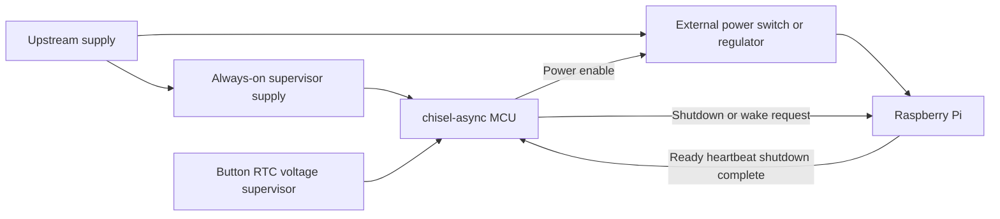

# RISCay-MCU for Raspberry Pi power supervision

Draft application specification, October 5, 2026. **Build RISCay-MCU in Chisel using chisel-async, verify it first with an existing simulator, then use it to qualify Chiselator.** Its first useful application is an always-on Raspberry Pi power supervisor: wake the Pi, request orderly shutdown, confirm completion, and control an external power switch. No MCU, firmware, board or validation results are implemented yet.

This is the first complete application of the [library-first roadmap](chisel-async.md), under [async model specification 03](specs/03-async-model-contracts.md). The MCU has its own dedicated repository, which the project owner will add when needed. It owns chip-specific ISA/RTL, firmware, board profiles, Pi integration, application tests and eventual physical implementation. chisel-async also has a separate dedicated repository. This document records the cross-project plan; it does not create either repository or publish artifacts.

RISCay-MCU is step 2 of the sequence: chisel-async → RISCay-MCU → Chiselator → physical chip build. Steps 2–3 use behavioral memory/primitive models and a simulated Pi environment. Physical memory selection, cell characterization, hardware debug/test access, pin/board design and tool dependencies are deferred to step 4; the later physical architecture may need revisions without blocking functional progress now.

Pin the MCU source/firmware revision, chisel-async artifact/contract version and Chiselator version together in application runs. Chiselator may retain small, licensed minimized regressions or pinned external fixture references, but does not own a duplicate MCU implementation. Repository URLs and actual dependency locks are established when the owner adds the repositories.

## Scope and baseline architecture

| Item | Proposed baseline |
| --- | --- |
| Processor | RISC-V required; proposed RV32EC core with sequential fetch/decode/execute, no pipeline or cache |
| Async implementation | Four-phase bundled-data channels, explicit latches/C-elements, reset and timing contracts from chisel-async |
| Program storage | Budget 2 KiB, with 1 KiB as a reduced build only if the complete tested firmware fits; fixed ROM initially |
| Data storage | Budget 256 bytes RAM; permit a measured 128-byte variant with explicit stack/state headroom |
| Instruction contract | Standard RV32E base plus C compressed instructions; no custom ISA; freeze execution environment and event-wait interface before firmware implementation |
| I/O | Budget 8–12 digital control/status signals; board profile assigns functions and electrical interfaces |
| Timekeeping | Independent external low-frequency timebase or RTC/timer events; no CPU instruction-count delays |
| Simulation | External event simulator first, then Chiselator CPU; pinned chisel-async views/timing metadata and independent references in both lanes |
| Physical target | Deferred step 4; GF180MCU/wafer.space are retained candidates to revisit, not current dependencies or commitments |

The CPU has no global periodic clock. A small clocked timer peripheral is allowed and must be explicitly isolated behind the library's event/domain bridge; “clockless MCU” describes the core, not a claim that accurate timekeeping needs no time source. Use event suspension rather than continuously polling a timer. Event capture remains active while the core waits; this is a platform requirement, not a new `WAIT` opcode.

The earlier 128-byte ROM was an area-estimation assumption for a demonstration. Start by measuring RISC-V firmware against the provisional 2 KiB ROM/256-byte RAM budget. Reduced 1 KiB/128-byte builds are experiments, not qualified configurations. Include startup code, helper routines, initialized data, worst-case stack and headroom; enlarge the memories and reassess physical fit if necessary.

Program ROM contains the linked fixed firmware image; simulation loads the same versioned image. RAM has a declared reset initialization policy. Embedded flash, field firmware update, caches, multiplication hardware, ADCs, battery charging, USB-C PD negotiation and control of the Pi's internal voltage rails are outside the first chip. Use a standard bare-metal RISC-V toolchain; a general interrupt controller is not required by the supervisor policy.

## RISC-V implementation and firmware contract

RISC-V specifies software-visible behavior, not the use of a periodic clock. Implement instruction execution through chisel-async request/acknowledge stages. The proposed RV32EC target has 32-bit architectural values and sixteen integer registers (`x0`–`x15`, with `x0` fixed at zero). C adds compressed instruction encodings to reduce program storage. Bring up RV32E first, then qualify C before claiming RV32EC support. [RV32E specification](https://docs.riscv.org/reference/isa/v20260120/unpriv/rv32e.html), [compressed instructions](https://docs.riscv.org/reference/isa/v20260120/unpriv/c-st-ext.html).

Evaluate a bit-serial or byte-serial internal datapath against a full-width implementation. Narrow hardware must still implement complete 32-bit register, arithmetic, address and memory semantics. Serialize accesses without duplicating MMIO effects, and measure response latency against supervisor deadlines. No M, A, floating-point or vector extensions are planned initially. The ISA choice belongs to the MCU; chisel-async remains reusable for other architectures and Chiselator continues to simulate hardware rather than interpreting RISC-V instructions.

Use pinned GCC/binutils with an explicit `-march=rv32ec -mabi=ilp32e`, freestanding C and assembly startup, a linker script and qualified runtime helpers. GCC documents ILP32E as subject to change, so record compiler/ABI versions rather than promising compatibility with arbitrary prebuilt libraries. Retain ELF, ROM image, disassembly, linker map and build flags; check the final binary for unsupported instructions and measure actual C/assembly firmware size. [GCC RISC-V options](https://gcc.gnu.org/onlinedocs/gcc/RISC-V-Options.html).

Before RTL implementation, freeze a little-endian execution-environment contract: reset PC, memory/MMIO map, access widths and ordering, alignment faults, reserved/illegal instructions, ECALL/EBREAK behavior and fault recovery. Define event waiting explicitly: a blocking MMIO event read is a candidate for the minimal platform; choosing architectural WFI instead requires a specified privileged/interrupt contract and corresponding tests. RV32EC alone does not settle that choice. Never silently reinterpret an instruction as a custom sleep operation. Pending events, reset cancellation and independent watchdog recovery must remain correct while a wait is outstanding.

## System boundary

The external switch/regulator carries the Pi's supply current. MCU pins only command that hardware. The supervisor is powered upstream of the switched Pi supply so it can wake a fully disconnected Pi. Board design must address switch rating/inrush, power-good, discharge/off interval, return paths and back-power through GPIO or attached peripherals. Use level-compatible, power-off-safe interfaces; open-drain or isolated switch emulation is selected per board signal, not assumed universally safe.

Use an external voltage supervisor/comparator for power-good/low-battery events initially. A low-battery warning only permits graceful shutdown if sufficient energy remains. Sudden upstream power loss cannot be made graceful by firmware alone; hold-up or backup energy is a separate board requirement.

Raspberry Pi 5 is the first proposed qualification profile. Its J2 connection exposes the onboard power-button function, which can be emulated through a suitable external interface. Wake and shutdown behavior vary by Pi model and OS configuration, so other boards need separate profiles. [Raspberry Pi power-button documentation](https://www.raspberrypi.com/documentation/computers/raspberry-pi.html#power-button).

## Control interfaces

These are logical functions; physical pin assignments and polarity belong to a versioned board profile. Multiple functions may share a protocol only after that implementation is qualified.

| Function | Direction | Contract |
| --- | --- | --- |
| `wake_event` | Input | User button or external wake request; capture/debounce without repeated unintended boots |
| `rtc_alarm` / `timer_event` | Input | Scheduled wake or elapsed-time event from an independent source |
| `power_good` / `low_supply` | Input | External supply condition; thresholds and hysteresis are board parameters |
| `pi_ready` | Input | Configured Linux service reports successful boot; absence is not an instruction to cut power immediately |
| `pi_heartbeat` | Input | Fresh transitions report health; a static high level cannot indefinitely satisfy the watchdog |
| `pi_shutdown_complete` | Input | Qualified late shutdown indication; distinguish from merely requesting shutdown |
| `pi_shutdown_request` | Output | Request graceful OS shutdown using a configured GPIO interface |
| `pi_wake_button` | Output | Bounded board-specific button action when a powered but halted Pi requires it |
| `pi_power_enable` | Output | Command the external switch; never directly drive the Pi's supply |
| Status/debug | Output/interface | Report state and last fault/forced-off reason within the storage budget |

Raspberry Pi's `gpio-shutdown` requests OS shutdown and `gpio-poweroff` can provide the late power-removal indication. The latter requires an external power-removal mechanism and changes normal shutdown/restart behavior; a board profile must test the actual kernel/overlay configuration. Do not treat a userspace “about to shut down” message or lost heartbeat as shutdown completion. [Official overlay contracts](https://raw.githubusercontent.com/raspberrypi/linux/rpi-6.12.y/arch/arm/boot/dts/overlays/README).

For the first profile, normal full shutdown uses the configured GPIO request/complete pair plus the external switch. J2 provides an optional soft-off wake/button path, not a second simultaneous shutdown policy. Reboot, soft-off wake and full power cycling each have explicit integration tests.

## Supervisor behavior

| State | Required behavior and transitions |
| --- | --- |
| OFF | Pi supply disabled; supervisor waits for a permitted button, RTC or external event |
| STARTING | Enable the supply; wait for power-good and boot-ready, with bounded startup timing and retry policy |
| RUNNING | Capture wake/control inputs, observe heartbeat and supply status; suspend the CPU while no work is pending |
| SHUTDOWN_REQUESTED | Request orderly shutdown; keep supply enabled while waiting for a valid completion indication |
| POWERING_OFF | On confirmed completion, disable the switch and wait for the specified off/discharge interval |
| FAULT | Record the reason; use the configured preserve-power, forced-off or bounded-retry policy; never label forced removal graceful |

Normal sequence: request shutdown, receive a valid completion signal, then remove power. A completion indication is armed only after its inactive state and the current boot's readiness have been observed. A stale high signal from a previous boot or reset cannot authorize power removal. Once armed, an OS-initiated shutdown may also authorize removal; a prior MCU request is not mandatory. Validate the selected signal's pulse/level pattern rather than assuming one clean permanent edge.

Use a monotonic independent timebase for button debounce, startup timeout, heartbeat timeout, shutdown timeout and minimum off interval. Values are board/firmware configuration recorded in the run manifest; choose them from measured Linux behavior and board timing before qualification. Counter width, wrap behavior, snapshot reads and atomic event acknowledgement must be specified. No timeout is measured by async instruction throughput or an uncharacterized logic delay chain.

Heartbeat expiry first requests graceful shutdown/recovery. The default timeout policy preserves power and reports a fault if shutdown completion never arrives. A separately enabled policy may force power off and retry after a minimum off interval, with a bounded retry count. Forced shutdown is an explicit recovery action with possible data loss, never a clean-shutdown PASS. Scheduled wake does not override a low-supply lockout.

## Reset and event reliability

On initial upstream power-on, hardware holds the Pi power-enable command OFF until supervisor initialization completes. A later CPU-only reset must not automatically interrupt an already running Pi: keep the switch command in an explicitly retained always-on output latch with a separate reset contract, release request/button outputs, and reconcile Pi readiness before resuming policy. Whole-supply loss or a board-level emergency shutdown has separate behavior and cannot promise retained power.

Event capture uses held/acknowledged events, pending latches or a qualified domain-crossing adapter as appropriate. An event arriving while firmware clears a pending bit or enters an event wait cannot be lost. Define whether repeated events coalesce or are counted; timer and heartbeat freshness require sufficient information to detect missed service and overflow. Unqualified raw pulses cannot be assumed to survive a domain boundary.

The independent timer/watchdog path must continue while the CPU waits. If CPU execution itself hangs, an external watchdog or a separately verified always-on hardware timeout must invoke the declared recovery policy. Merely checking the Pi heartbeat in stalled firmware is not a supervisor watchdog. Brownout/reset and output-retention behavior need physical verification in addition to digital models.

A stopped timebase cannot diagnose its own absence. Bounded recovery from timer failure requires an independent watchdog/reference or external fault indication; a profile without that facility must declare timer-loss recovery unsupported. Simulation must not inject a convenient fault signal that the proposed board cannot actually produce.

## Chiselator simulation and independent evidence

First compile the MCU's Chisel/chisel-async design through the pinned CIRCT export path and run its emitted RTL on a qualified external event simulator. Freeze the C0 reference bundle before the main Chiselator implementation. Then run the same application in Chiselator at S0. Include the exact ROM image, library/model versions, board profile, timer configuration, reset policy and external stimulus in every reproducible run. Chiselator native CPU execution is required at S0; ACT/GPU are optional and cannot replace a missing baseline capability.

Model the Pi as a configurable environment with boot delay, ready/heartbeat outputs, late shutdown acknowledgement, reboot, hang and absent-response cases. Model the switch, power-good and external timer separately. This is a digital environment model, not an emulation of Linux or proof that a real board behaves identically.

Use two independent references: an instruction-level model compares retirement and committed memory/I/O effects, while a separately specified supervisor model checks legal power-state transitions and timing policy. They must not derive expected results from the production RTL or observed retirement stream. Retain the external event-simulator lane when Chiselator becomes the primary application simulator; the new engine must agree with independently established behavior.

## Acceptance tests

| Suite | Required evidence |
| --- | --- |
| MCU-01 Firmware and execution | Boot, arithmetic/branches, RAM/MMIO, event wait/wake and complete supervisor firmware match independent instruction/effect traces; binary and memory usage fit the selected budgets |
| MCU-02 Normal power lifecycle | Cold start, ready, button/RTC wake, commanded and OS-initiated graceful shutdown, full power cycle and reboot; switch-off follows the correct late acknowledgement |
| MCU-03 Fault and timeout policy | Boot hang, stale/missing heartbeat, absent/stale/early shutdown acknowledgement, low supply, timer loss/overflow and bounded retries; graceful and forced-off outcomes remain distinct |
| MCU-04 Async and reset integrity | Reset at every handshake/power-policy phase, simultaneous event/clear/wait, repeated payloads/events and randomized legal delays; no lost wakeup, duplicate effect or unintended cut on CPU reset |
| MCU-05 Real Pi integration | Exact Pi model, OS/kernel/overlay and board profile; observed shutdown/wake/reboot timing, power-off-safe interfaces and actual switch behavior agree with the environment model within declared limits |
| MCU-06 Physical feasibility | Updated mapped/floorplanned area, preserved async timing, routed checks and DRC/LVS evidence; characterize always-on current and reset/watchdog behavior before power claims |

MCU-01 includes applicable RISC-V architectural tests plus independently generated instruction sequences. Qualify the reference model and test harness for RV32E/C before relying on them; unsupported configurations are gaps, not passes. Cover x0 immutability, reserved upper-register encodings, signed/unsigned arithmetic and comparisons, shifts, byte/halfword/word accesses, alignment/fault behavior, mixed 16/32-bit instruction fetch and control flow, and exactly-once MMIO effects under stalls/reset. Compare architectural retirement and effects, not internal cycle counts. Exercise the compiler-generated firmware and runtime helpers as well as directed assembly; passing ISA tests alone does not qualify async timing or the Pi power policy.

MCU-01–04 gate the simulated application, first externally at C0 and again in Chiselator at S0. MCU-05/06 and [PHY-01–06](chip-build-plan.md#tests-and-evidence) are deferred to step 4 for real Pi compatibility, physical fit and power claims. Required functional activity includes actual firmware completion/transition coverage and checker hits. Inject premature power removal, dropped events and stale completion signals; each must fail the intended checker. A Pi environment that always answers immediately cannot qualify fault recovery. Follow the [scientific test plan](test-plan.md#scientific-method-and-limits-of-claims).

Power validation measures the whole supervisor subsystem, including regulator, timer, interfaces and leakage while the Pi is off. Async execution alone is not evidence of lower standby power. Digital switching counts do not establish watts or battery life.

## Area and delivery gates

The physical area estimates and target below are retained as step 4 research notes. They do not impose a physical feasibility gate on steps 1–3; recheck process, slot, area and schedule when step 4 begins.

The wafer.space Run 3 quarter slot's default core is approximately 1.05 × 1.65 mm, or 1.73 mm², inside a 1.94 × 2.53 mm die. Use the default pad ring as the planning baseline. [Published slot dimensions](https://mith.ro/gf180mcu-project-template/).

Aim for an initial floorplan of no more than 1.2 mm² of core allocation, retaining margin for timing repair and routing. The earlier 0.6–1.4 mm² estimate assumed an 8-bit core and only 128 bytes each of ROM and RAM and is **not an estimate for this RISC-V supervisor**. Recalculate using the 32-bit architectural register storage and access logic, chosen serial/full-width datapath, compressed decoder, actual firmware ROM, RAM access logic, retained output state, event/timer bridge, test/debug structures and characterized async cells. RV32E and serialization are area-saving candidates, not proof of quarter-slot fit. External switch, RTC and supply components consume board area, not the die core; any later integration of them changes the estimate.

1. **chisel-async:** qualify L0–L2 against functional contracts and independent external tests, without a PDK or physical implementation probe.
2. **RISCay-MCU:** freeze the functional ISA/execution environment, behavioral memory/latency and event-wait contracts, firmware and simulated Pi policy. Measure firmware/stack use and pass MCU-01–04 externally at C0. Physical RAM/ROM technology, pins and manufacturing test remain deferred.
3. **Chiselator:** build the simulator and pass the same application at S0 with independent references, negative controls and replay evidence. Declared model delays support functional timing checks; mapped or routed artifacts are not required.
4. **Physical chip build, deferred:** revisit dependencies and the physical architecture, then perform P1 feasibility, P2 implementation and P3 board/silicon qualification from the [step 4 backlog](chip-build-plan.md). Address synthesis/Yosys, PDK, memory technology, debug/test access, layout and fabrication choices then.

Run 3 is a historical target to reassess in step 4, not an active submission commitment. Fit, deadline and tool readiness are deferred decisions. Physical-library breadth, GPU and ACT support are not prerequisites for this MCU to run in Chiselator.
