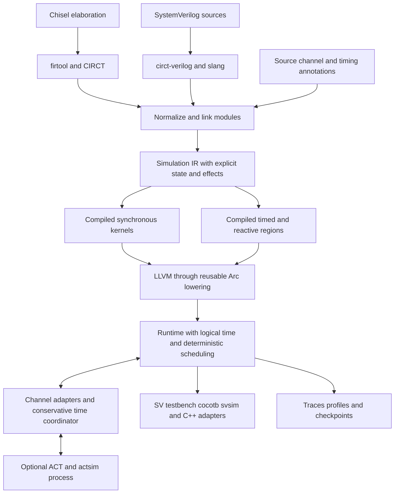

# Chiselator simulator design proposal

Draft for architectural review. Revised October 5, 2026 following project feedback.

The companion [software architecture](software-architecture.md) translates this proposal into component boundaries, data contracts, runtime interfaces, and an implementation sequence.

**Four-step product order:** build and independently qualify [chisel-async](chisel-async.md), then [RISCay-MCU](async-mcu.md) on an existing simulator, then Chiselator, then physical chip implementation. The Apache-2.0 library evolves async Chisel ideas through its own API, component catalog and verified contracts; it is not a renamed copy of ASYNC-Chisel. Its component corpus and the MCU's external reference bundle become inputs to native Chiselator qualification. Physical feasibility and all physical dependency decisions are deferred to the [step 4 backlog](chip-build-plan.md).

## Review summary

Build a tool for one team's clockless async chip, open to others through a public repository, usable releases, and documented extensions. Compare QDI (quasi-delay-insensitive), bundled-data, and GALS (globally asynchronous, locally synchronous) implementations of the same function under shared channel tests. **Clocked support remains first-class:** standalone synchronous designs, conventional clocked IP, multiple clock domains, and pausable local clocks are required. An all-clocked design needs neither async wrappers nor ACT to run.

Use explicit events, state, and timing as the semantic foundation; compile synchronous regions into specialized fast paths. Reuse CIRCT/Arc where a timeboxed experiment establishes correct scheduling. Keep project-specific passes out of tree initially. Use an optional ACT/actsim process for CHP/production-rule QDI models, while native Chisel/SV async primitives work without ACT. Steps 1–3 extract relative-timing intent and check behavior under declared model delays; mapped-netlist/SDF/static-timing qualification waits for step 4.

M1 includes a one-command experience and a self-contained simulator executable with no external C++ compilation for the built-in SV/compiled-RTL path. Standard testbench adapters and packaging have explicit acceptance tests. The v1 synchronous performance target is faster than Verilator and within 20% of design-appropriate GSIM throughput on a frozen overlapping suite; beating GSIM is a stretch goal. These are proposed release gates, not measured results.

**Decisions requested from reviewers:**

1. Accept the channel architecture, native clocked/async support, and optional ACT process boundary.
2. Staff chisel-async L0–L2, then RISCay-MCU C0, then Chiselator and its timeboxed Arc experiment; re-estimate the simulator envelope after functional probes. Physical feasibility and its staffing/dependencies are step 4 work to plan later.
3. Adopt the staged feature/test matrix and proposed 20% GSIM margin before performance tuning.
4. Choose the final project name and review dependency packaging before distribution. The project license is Apache-2.0, as selected by the owner; “Chiselator” remains a working name.

**Non-goals for v1:** UVM/classes/constrained randomization, a universal SV implementation, analog metastability simulation, a replacement synthesis/place-and-route flow, complete SDF coverage, or proof of physical timing correctness from RTL random testing. The chip stays in a separate repository and uses public extension points.

**Top three risks:**

| Risk | Required response |
| --- | --- |
| Lost event ordering across compiled regions or ACT | Explicit phase contract, conservative co-simulation, independent reference traces |
| RTL timing intent fails to map to implementation | Source annotations, checked provenance through synthesis, netlist/SDF and STA agreement |
| Packaging and language breadth overwhelm a small team | One supported chip workload, bounded testbench subset, independently gated platform and adapter lanes |

## Scope within the larger toolchain

Simulation is the first deliverable. Preserve source locations, hierarchy, bit widths, clock and reset intent, memory semantics, channel contracts, and timing intent for linting, formal checks, synthesis integration, and performance analysis. A versioned project manifest identifies sources, top module, parameters, bindings, toolchain revisions, overrides, and workloads.

Use existing frontends and implementation tools. A familiar restricted SV testbench language, cocotb, Chisel svsim, and C++ are delivery requirements with separate tests. ACT/CHP integration starts in M0 and delivers in M2; it is not a prerequisite for native simulation.

Use a hybrid implementation: Rust for the runtime, scheduler, primitives, channels, CLI/MCP, jobs and reports; C++ for CIRCT/MLIR transformations, LLVM lowering and initial JIT integration. A narrow versioned C interface separates compiler objects from Rust-owned sessions. Python provides the independent reference evaluator and test/benchmark orchestration. Generated simulation kernels execute directly; normal built-in simulation invokes neither a Rust nor an external C++ compiler. See the [language and ownership contract](software-architecture.md#hybrid-implementation-language-contract).

Pin Rust/Cargo dependencies alongside the native compiler toolchain, and validate the mixed build, ABI and code lifetimes in M0/M1. CPU execution is the baseline; optional GPU backends use the same semantic contracts with target-specific layouts and code. Required native releases target Windows x86-64, Linux x86-64 and macOS arm64. WSL is optional and cannot substitute for Windows qualification. The repository has documentation and a license, not an implemented simulator.

The [five implementation specifications](specs/README.md) refine this proposal and take precedence over overlapping sketches. The first complete application is RISCay-MCU, a Chisel bundled-data RISC-V supervisor. Steps 1–3 require no Yosys, PDK or physical chip build. Synthesis and process choices, including the Yosys question and GF180MCU candidate, are deferred to [step 4](chip-build-plan.md#synthesis-decision); no answer is needed now. Functional release gates require declared-model evidence only.

## Evidence and corrections to the supplied analysis

The supplied experiments are input evidence, not independently reproduced results. The follow-up identifies GSIM `210689a` (reported September 22, 2026), ready-to-run `55803f6`, clang 19.1.1, and a shared two-core cloud container with simulation pinned to one core. Rocket ran CoreMark for 4.2 million cycles. Baseline throughput was 309k–327k cycles/s across three runs; the hot-supernode experiment achieved 347k–363k across three runs with the same final-state hash. About 5% spread and same-workload training limit the conclusion.

The named patches are `gsim-fix-stale-active-flags.patch` and `gsim-pgo-always-active.patch`. Their contents, full logs, and raw profiles are still not supplied here. The feedback reports source confirmation at that revision for the unused `C` array, `minOrder = -1`, `activateNext(..., inStep=false)`, and broken PERF harness. Reproduction should resolve full commit hashes and retain these artifacts.

| Supplied observation | Status in this proposal | Consequence |
| --- | --- | --- |
| Rocket runs at roughly 322k cycles/s, or 355k with selected partitions always evaluated | User-supplied result; approximately 10.2% improvement on the profiling workload | Reproduce with separate training and evaluation workloads before adopting a threshold |
| About 138 of 1,423 supernodes execute per cycle; 65 hot nodes account for 46% of evaluations | User-supplied profile | Measure work in time or weighted operations as well as evaluation counts |
| An always-active member prevents neighboring activation flags from clearing | Reported correctness/performance defect in bookkeeping | Make a minimal mixed-group regression and compare original, fixed, and new schedulers |
| `validActive`, PERF compilation, partition refinement, and `checkOutcoming` are broken or dormant | User reports source confirmation at `210689a` | Reproduce independently before attributing a speedup to these fixes |
| GSIM compilation takes 26 s and 1.8 GB; generated C++ takes about eight minutes on two cores | User-supplied, machine-dependent measurements | Track frontend, optimization, code generation, host compilation, and first-result time separately |
| Merging repeated flag writes did not improve runtime | Negative result supplied by the user | Low priority unless instruction-level evidence on a new backend justifies revisiting it |

GSIM's upstream repository confirms the CHIRRTL-to-C++ flow and provides ysyx3, Rocket, BOOM, and XiangShan examples. Its published speedups are results for its own experiment configuration, not transferable performance expectations for Chiselator. [GSIM repository](https://github.com/OpenXiangShan/gsim), [GSIM paper](https://arxiv.org/abs/2508.02236).

Apply the stale-flag correction per design: the supplied Rocket configuration has no extmodules, so original and corrected GSIM should behave and perform equivalently there. The supplied minimal XiangShan configuration has 164 extmodules and can exercise the defect. Record the grouping and regression outcome rather than assuming every benchmark benefits from the fix.

Several architectural claims need qualification:

- **The common representation is a family of dialects.** `circt-verilog` uses slang, but accepted syntax does not establish that downstream lowering and simulation support the design. Preserve process and timing behavior instead of forcing every SV construct into `hw`/`comb`/`seq`. [CIRCT frontend documentation](https://circt.llvm.org/docs/Tools/circt-verilog/).
- **Arcilator deserves a current evaluation.** Arc documentation now describes LLHD process/coroutine lowering, persistent state, and timed wakeups as well as LLVM compilation. This is evidence of relevant machinery, not proof of complete SV or async compatibility. [Arc dialect](https://circt.llvm.org/docs/Dialects/Arc/).
- **Event-driven semantics do not imply interpreter performance.** Normal Computing reports a 100–1000× gap for its implementation and describes incomplete JIT coverage. This motivates compilation and tight scope; it does not establish an inherent slowdown for all compiled event-driven designs. [Normal Computing report](https://normalcomputing.com/blog/building-an-open-source-verilog-simulator-with-ai-580k-lines-in-43-days).
- **Async feedback is not generally a combinational fixed point.** Latches and C-elements retain state; delayed loops can represent legitimate ongoing activity; arbiters require a model of choices. Zero-delay testing alone also cannot establish QDI correctness or isochronic-fork assumptions.
- **One barrier per cycle is conditional.** Replication can remove dependencies between pure synchronous partitions. Multiple clocks, shared memories, side effects, and async boundary events may require additional ordering. [RepCut paper](https://escholarship.org/uc/item/1345b80b).
- **DPI is not a cocotb implementation.** A useful cocotb backend needs GPI integration, commonly through VPI, with correctly implemented callback phases. [cocotb timing model](https://docs.cocotb.org/en/stable/timing_model.html).

## Architecture and reuse boundary



This is the intended integration, conditional on M0. Chisel contributes structured RTL through firtool; SystemVerilog contributes structure and processes through slang/CIRCT. Neither language requires a new frontend IR solely to coexist. Extend existing dialects with the minimum channel, timing, and scheduling metadata needed by the runtime.

The native compiler input contract is a **versioned, verified subset of CIRCT/MLIR**, not arbitrary CIRCT IR. Chisel elaborates to FIRRTL and is lowered through firtool; SystemVerilog is parsed/elaborated by slang through circt-verilog. Normalization brings supported structure and logic into `hw`/`comb`/`seq`, retaining LLHD process/event/timing operations wherever required. Link both paths before simulation lowering. Preserve channel and timing intent as attributes or small extension operations with defined semantics.

Arc is the preferred simulation-oriented lowering layer, subject to M0's ordering tests. LLVM generates native machine code; the Chiselator runtime executes it and coordinates clocks, reactive work, and delayed events. We therefore compile a shared circuit model rather than interpret either source language directly. Both clocked and asynchronous execution use this contract. A new operation is justified by missing semantics or optimization needs, not by the existence of two source languages. Frontend acceptance alone does not establish simulator support; every supported operation must pass normalization, lowering, and runtime tests. [CIRCT frontend](https://circt.llvm.org/docs/Tools/circt-verilog/), [LLHD](https://circt.llvm.org/docs/Dialects/LLHD/), [Arc](https://circt.llvm.org/docs/Dialects/Arc/).

Build chisel-async as an independently releasable Chisel library with typed protocols, composable storage/control, C-elements, latches, delay intent, mutexes, timing contracts and clocked/memory interfaces. Its annotated extmodules have external SV simulation views before native simulator bindings exist, so an async design written in Chisel need not include handwritten SV. Check widths, parameters, semantic versions and endpoint manifests at elaboration and import. Its defined completeness catalog and stack compatibility matrix are in the [library architecture](chisel-async.md). This builds on Chisel's documented external-module mechanism. [Chisel external modules](https://www.chisel-lang.org/docs/explanations/blackboxes).

Use a thin simulation representation around CIRCT operations and explicit scheduling metadata before committing to a large new dialect. It must represent pure combinational regions, registers and latches, memory ports, processes, delayed drivers, subscriptions, and foreign effects. Keep hierarchy for diagnostics and possible code sharing even when optimization flattens a region.

Every stateful or external operation declares what wakes it, when it reads and commits state, and whether it has observable side effects. Unknown black boxes are errors unless bound to a model. Pure external functions may be memoized; stateful models need explicit event/clock callbacks. Marking an opaque module always-active is not a substitute for knowing its semantics.

The runtime graph uses dense IDs, compact adjacency arrays, and generation counters for visited/dirty state. Keep editable adjacency during graph-changing passes, then compact it for execution. Batch necessary rebuilds and measure pass costs. Runtime IDs are stable within a compiled artifact; semantic channel/constraint IDs and checked provenance handle re-elaboration. Instance paths alone are not persistent identities.

### Interchangeable blocks and typed channels

At architectural block boundaries, define a typed channel contract: payload schema, protocol, reset/initialization, transaction identity, ordering, backpressure, and completion obligations. Bind each block to a behavioral reference, QDI implementation, bundled-data implementation, or synchronous implementation behind an async adapter. The testbench drives transactions once; adapters perform the encoding and handshake conversions. Functional equivalence means matching allowed transactions and ordering, not matching latency or internal waveforms.

Internal RTL and imported legacy clocked IP may use ordinary wires and clocks. Channel wrappers are needed for architectural substitution and mixed-style boundaries, not as a restriction on every wire in an existing synchronous design. Adapter buffering, reset, delays, and power/area costs are observable and reported separately; a zero-cost adapter would bias comparisons.

Expose three linked views: transaction tests for interchangeable blocks, protocol transitions for handshake safety, and gate events for hazards and timing. A channel-level ACT boundary cannot validate an isochronic fork crossing that boundary. Keep such a fork and its consumers within one gate-level engine, or use an explicitly tested signal-event boundary that preserves all relevant transitions.

### Optional ACT co-simulation

Use ACT/actsim as the default backend for ACT/CHP and production-rule QDI inputs. It already supports mixed abstraction levels and randomized delays. ACT also documents synchronous logic as a special case and Verilog netlist export; the feedback's blanket claim that it has no synchronous logic or Verilog capability is too strong. This does not establish a general SV simulation frontend. The opportunity is a consistent Chisel/SV/ACT workflow and shared contracts. [ACT overview](https://avlsi.csl.yale.edu/act/doku.php?id=start), [ACT simulation](https://avlsi.csl.yale.edu/act/doku.php?id=tools:actsim).

Keep ACT in a separate optional process over a versioned pipe/socket protocol. M0 must determine whether a thin command adapter suffices or actsim needs a separately maintained extension. Do not assume its command interface already exposes the next-event and phase controls required for safe co-simulation.

The protocol carries model/contract hashes, precise logical timestamps, event or transaction IDs, payloads including explicit unknown status, next-event/lower-bound information, and completion/error acknowledgements. The coordinator grants conservative advancement only to a safe frontier. At a shared physical time, exchange boundary changes until both engines report quiescence under the agreed phase mapping before advancing. Without positive lookahead, serialize boundary processing; never batch across a potentially earlier response. Reject a backend that cannot expose a safe frontier rather than allowing causality errors.

Test simultaneous requests, zero-time round trips, reset, backpressure, differing precisions, process crashes, and seeded replay. A worker exit is a simulation failure, not an empty channel. Checkpoints require both engines' restorable state and in-flight messages; disable cross-engine checkpoints until that contract is implemented. SV and Chisel fixtures must also pass with ACT absent.

### The Arcilator decision experiment

Timebox Arc evaluation to **10 working days for one compiler engineer**, with a verification engineer available for oracle review. Pin compatible toolchain revisions. Test delta-step and scheduling-phase preservation first: blocking/nonblocking ordering, nonblocking re-entry, `#0`, simultaneous clocks, and observation callbacks at one physical timestamp. Arc documents `i64` femtosecond time and wakeups; that alone does not encode delta/phase state, nor prove it is lost elsewhere in the pipeline. Inspect lowering and compare ordered traces. [Arc time operations](https://circt.llvm.org/docs/Dialects/Arc/#arccurrent_time-circtarccurrenttimeop).

Then test both clock edges, asynchronous reset, memory collisions, latch transparency, a delayed pulse, C-element state, and a bundled-data stage. Start with out-of-tree passes and a scheduler adapter so upstream acceptance is not on the critical path.

Evaluate the native backend options against the same cases; ACT is a complementary backend:

| Path | Prefer when | Main cost |
| --- | --- | --- |
| Extend Arc/Arcilator with out-of-tree passes and runtime hooks | All required ordering survives or is restored by the tested adapter | Tracking upstream APIs; contribute generic changes separately |
| Reuse CIRCT imports and Arc/LLVM kernel lowering with a Chiselator scheduler | Kernel generation works but runtime policy cannot express the required events cleanly | A separate scheduling and integration layer |
| Extend Verilator 5 | Its SV timing and threading infrastructure reduces semantic/integration work | Generated C++ normally requires a host compiler, conflicting with the primary install contract; assess an embedded compilation path explicitly |
| Own simulation lowering after CIRCT import | Demonstrated semantic or compile-time barriers block both reuse paths | The largest correctness and maintenance burden |
| Co-simulate ACT/actsim | ACT/CHP/production-rule QDI implementation is selected | Optional process dependency, timestamp coordination, and adapter overhead |

Arc passes when every mandatory ordering fixture agrees with the reference, timing/state survive the pipeline, and remaining integration work is estimated within two engineer-weeks without replacing its central lowering. A failure or unresolved result at day 10 triggers the owned-scheduler/kernel-reuse fallback assessment and Verilator comparison; it does not trigger an open-ended upstream rewrite. Select a backend with a written trace matrix, patch scope, packaging consequences, and estimate. Building a wholly owned backend requires evidence that reuse options fail the requirements. Verilator's timing support is established, but suitability for this packaging and async contract still needs the experiment. [Verilator language support](https://verilator.org/guide/latest/languages.html).

## Execution semantics

### Logical time and observable ordering

Define simulation time as integer ticks at a declared precision, plus delta iteration and an explicit scheduling phase. Reject overflow and lossy timescale conversion. LLHD already represents physical time, delta, and epsilon components; mapping these to the supported SV behavior must be tested rather than assumed. [LLHD dialect](https://circt.llvm.org/docs/Dialects/LLHD/).

Maintain separate queues for current-time reactive work, pending state/nonblocking updates, and future timed events. Iterate reactive evaluation and eligible update phases as required before exposing the designated observation point. Changes committed by nonblocking assignments can wake further work at the same physical time. A lexicographic timestamp alone does not implement the SV scheduler; the phase transitions and re-entry rules are part of the language contract.

For race-free supported designs, use stable object IDs to make internal ordering reproducible. Preserve required source-process ordering. Determinism must not be advertised as resolving an SV race: diagnose supported detectable races, and use optional order perturbation to expose dependence on otherwise unspecified ordering.

Simultaneous clock edges sample the correct shared pre-update state before state commits become visible. Async resets can interrupt between clock edges. Transparent latches react while open. Memory read/write and write/write collisions follow the declared source semantics or model contract; never choose behavior based on host thread order.

Represent every clock as an event source with observable edges. Fixed-period generators are conveniences. Local oscillators can pause, stretch, resume, or be handshake-controlled; cancellation must not leave a previously scheduled edge in the queue. Tests cover posedge/negedge, coincident unrelated clocks, gated/generated clocks, pausable GALS clocks, CDC FIFOs, and reset while stopped. A fixed-cycle loop is only a proven optimization of this behavior.

### Synchronous specialization

Compile proven synchronous regions into native functions over current state, inputs, and next state. Within a suitable region, evaluate pure combinational dependencies in topological order and skip inactive partitions. A direct clock-step call avoids allocating an event for every gate or register. The outer scheduler still limits advancement to the next external, reset, timer, or cross-region event.

A region qualifies only when relevant state transitions, effects, and observations are preserved by the transformation. Observable glitches, arbitrary delayed assignments, transparent feedback, or callbacks inside the interval block this optimization unless handled explicitly. Generated clocks require proven scheduling or remain event signals.

The fast path is an optimization of the event contract. It is not a separate meaning of the circuit. Debug mode can compare optimized stepping with conservative execution at every observable boundary.

### Feedback and reactive regions

First recognize explicit state, delayed arcs, and registered primitive models. Analyze the remaining zero-delay dependency graph for strongly connected components (SCCs). SCCs are useful scheduling and diagnostic units, but collapsing them must not erase internal events that a supported observer can see.

Use a worklist for reactive logic and bounded delta iteration for residual zero-delay feedback. Preserve process assignment semantics rather than solving arbitrary Boolean equations for a convenient answer. Reject unsupported loops; for supported iterative models, report repeated states or an iteration limit with the involved instance paths. A positive-delay oscillator advances time and is legitimate unless a test's progress contract says otherwise. A zero-time loop that prevents time advancing is a separate diagnostic.

### Value semantics

Offer two explicit configurations: fast two-state execution with reproducible initialization, and an X-aware diagnostic configuration for the supported operators and state. Choose value semantics before optimization. Random initialization is an experiment, not an implementation of X propagation.

M2 uses two-state values plus a shadow initialized bit per primitive state element to diagnose a read before reset or another defined initialization. Check it before that read affects control or data. This catches never-initialized latches/C-elements; it does not model partial unknowns, unknown propagation, conflicting drivers, or metastability. Full X-aware operators are a separately gated later feature, not a dependency of the first async stage. Until available, an ACT boundary value containing X must produce an explicit diagnostic or use a declared conversion policy; the shadow bit cannot faithfully carry it.

Four-state support may initially cover a limited isolated cone or an entire small model. If an X/Z-capable output enters two-state logic, either promote the affected dependency cone or require an explicit conversion policy that diagnoses unknown values. Do not silently convert X to zero or confine unknowns merely by labeling one region asynchronous. Resolved multi-driver nets, drive strength, and general tri-states are outside the initial scope; reject them until their resolution semantics exist.

LLVM supports arbitrary-width integer types, but large values still need legal code generation and efficient storage. Lower overshifts, signed operations, division edge cases, and truncation with hardware semantics. Do not encode hardware unknowns as LLVM `undef` or `poison`. [LLVM language reference](https://www.llvm.org/docs/LangRef.html), [LLVM undefined behavior manual](https://llvm.org/docs/UndefinedBehavior.html).

## QDI bundled-data and GALS support

The first complete workload is the [Raspberry Pi power-supervisor MCU](async-mcu.md), built with chisel-async and simulated using Chiselator. It implements RISC-V (proposed RV32EC) with handshake fetch/decode/execute, provisional 2 KiB program storage/256-byte RAM, GPIO and independent timekeeping. Firmware storage and physical fit must be remeasured for this architecture. Independent RISC-V instruction-level and supervisor models check retirement/effects, wake, graceful shutdown, external switch control, reset and fault policy. The MCU and chisel-async each have a dedicated repository to be added by the owner. A small pipeline and selected MCU block provide behavioral, QDI, bundled-data, and wrapped clocked substitutions under shared transaction/reset/backpressure tests.

| Style | Execution model | Required checks |
| --- | --- | --- |
| QDI | ACT/CHP/production rules through actsim, or native Chisel/SV primitive compositions | Dual-rail validity and spacer sequencing, completion, gate-output glitches, declared isochronic forks, deadlock obligations |
| Bundled data | Native latches/control models, RTL randomized delays, mapped netlist delays | Protocol safety, extracted data-before-control constraints, netlist setup/hold and relative margins per transaction |
| GALS | Local event-based clocks plus async channel adapters | Clock pause/resume, synchronizer assumptions, FIFO pointer crossings, modeled metastability robustness |
| Conventional clocked RTL | Native Chisel/SV registers, memories, and clock domains | Edge/reset semantics, combinational behavior, memory ordering, and CDC where present |

QDI zero-delay runs test functionality only. Randomized gate delays and explicit fork checks can expose hidden timing assumptions; passing tests does not prove delay insensitivity. Preserve gate-output transitions in the detailed mode so a transient invalid dual-rail code or glitch cannot disappear inside an optimized kernel. ACT's own checks are one oracle where semantics align, not proof of the whole mixed system.

### Primitive and channel contracts

Provide versioned models for a Muller C-element, a level-sensitive latch, delay elements, mutex/arbitration, and synchronizer abstractions. Prefer explicit bindings and annotations over heuristic recognition of gate loops. A recognized implementation must pass equivalence tests against its primitive contract.

A C-element updates when its inputs unanimously agree and otherwise retains its prior state, with specified reset and unknown behavior. A latch has an explicit transparent interval and capture behavior. A mutex preserves mutual exclusion and records arbitration decisions; it is not synthesized into an arbitrary fixed-point result. Synchronizer models expose configurable sampling uncertainty and resolution latency rather than claiming to reproduce analog metastability.

Each channel contract identifies data, request, acknowledge, launch, capture, reset polarity, protocol phase, and the condition under which the producer may change data. Four-phase checks enforce the legal request/acknowledge sequence. Two-phase checks count toggles and associate each transaction with its acknowledgement. Dual-rail validity, spacer transitions, and completion checks belong to the first QDI integration, without imposing dual rail on bundled-data channels.

### Source timing intent and implementation checks

Scope: source/model provenance and declared-delay checks belong to step 3. The mapped-netlist, SDF, STA and physical characterization extensions described below are retained for step 4 only; they are not functional release requirements or current dependencies.

At RTL, specify required event relationships rather than claiming that user-entered delays describe the implemented circuit. Extract each stage's data-before-capture, hold, reset-release, and relevant fork assumptions into a versioned constraint graph. Export checked endpoints and relative constraints to an STA adapter. Some async relationships require paired min/max path queries and a checker around the timing engine; do not assume generic clock-based SDC alone expresses them.

Carry intent in Chisel annotations/intrinsics and SV attributes passed through CIRCT. Assign semantic IDs at declaration, retain origin-to-lowered-to-mapped provenance, and diagnose missing, duplicated, or ambiguous endpoints after re-elaboration or synthesis. These IDs need migration when the semantic object changes; annotations do not make refactoring identity automatic. Sidecars supply explicit overrides, corner selection, and SDF bindings, not the primary source of intent.

Use randomized RTL delays to test protocol robustness and identify order-sensitive behavior. A constraint exporter test verifies extraction and mapping, not physical timing. M2 must recover expected constraints from source and report lost annotations; deleting or changing a source constraint must change its exported graph.

In **step 4**, revisit mapped netlist simulation with SDF and the earlier M3 implementation-timing proposal. Then select and qualify a cell library, models, synthesis flow and corners for a small bundled-data stage. A future bounded SDF importer must report annotation coverage, reject unsupported required records/unresolved cells/unannotated critical paths, and compare timing-engine reports to dynamic violations. These tools and fixtures do not gate step 3 or its performance work.

For a common launch reference, check the following relationships using implementation-derived bounds and transaction observations:

```text
earliest capture >= latest data arrival + setup time + safety margin
earliest next data change >= latest capture + hold time
```

The bounds include data/control paths, skew, cell setup/hold requirements, and corner assumptions. A transparent latch may need checks over an aperture rather than at one nominal instant. Test both a passing mapped circuit and an intentionally undersized delay-line implementation, regenerate their timing artifacts, and require the latter to fail. This validates the implementation flow, beyond checking edited annotation numbers. Post-layout parasitics and broader corners remain necessary for signoff outside the simulator.

Associate launch/capture with transaction IDs, so repeated equal data values do not incorrectly imply that a new computation arrived on time. Report static worst-case bounds separately from sensitized dynamic paths: simulation covers observed activity, while STA checks the modeled path constraints. Reset and backpressure must preserve the transaction association.

Record min/typ/max selection, corner, library/netlist/SDF hashes, and endpoint mapping in the run manifest. Full SDF and general `specify` support remain outside the initial subset. ACT's timing-fork specifications are prior art for explicit relative constraints. [ACT timing specifications](https://avlsi.csl.yale.edu/act/doku.php?id=language:langs:spec).

### Delay modes and event handling

| Mode | Purpose | Limitation |
| --- | --- | --- |
| Zero-delay functional | Test protocol sequencing and functional data movement quickly | Does not validate matched delays or physical hazard freedom |
| Netlist with SDF | Check implementation-derived delays, relative margins, and supported cell timing checks | Requires mapped cell models and complete relevant annotations; not physical signoff |
| Seeded randomized | Stress timing margins and reproducibly expose races | Passing seeds is not a proof over all allowed delays |
| Bounded choice exploration, later | Explore arbiter choices and small timing/order spaces | State-space growth requires explicit bounds |

Specify transport and inertial behavior separately. Transport preserves transitions; inertial models may reject pulses using a declared rule. Pending transactions need payload snapshots and cancellation identities. Ordinary dirty-bit deduplication is safe only when the language/model semantics allow reevaluation to coalesce; it must not discard two delayed transitions to the same signal.

Start with a binary heap for future events and dense worklists for same-time activity. Measure before adding timing wheels or calendar queues. Random delay sampling supports per-instance manufacturing variation, correlated corner changes, and optional per-transition jitter as distinct policies. Independent random gates are not a realistic universal process model. Record the policy, seed, stable object IDs, and sampled choices for replay. ACT already provides random delays and arbitration choices, so these features have established prior art. [ACT simulator](https://avlsi.csl.yale.edu/act/doku.php?id=tools:actsim).

An empty event queue is quiescence, not necessarily deadlock. Report a stuck channel when outstanding obligations and declared environment assumptions establish lack of progress; otherwise report a timeout or possible deadlock. Arbitration outcomes can legitimately differ between seeds, so compare protocol safety and allowed outcomes rather than requiring identical final states across all schedules. Metastability injection similarly tests robustness under a chosen digital abstraction; it does not estimate physical failure rates.

## Optimizing clocked regions

Keep GSIM's useful ideas: activity-driven evaluation, deterministic generation, constant propagation, width narrowing, and splitting nodes where it reduces unnecessary computation. Apply them to standalone clocked designs and synchronous islands once the mixed-timing semantics work. Beating GSIM is a later optimization goal, not the reason to delay async usability. ESSENT is additional prior art for exploiting low activity. [ESSENT repository](https://github.com/ucsc-vama/essent).

### Correct and measurable activation

Maintain independent concepts for dirty state, forced evaluation, and whether a block is eligible at this clock/event phase. Clearing a dirty group must not depend on a neighboring block's forced status. Clear or consume an activation before running the block, or use generations/current-next worklists, so activation created during execution cannot be lost.

Build counters for evaluations, useful evaluations that change an observable dependency, output changes, activation attempts, duplicate activations, comparison bytes, scanned words, queue operations, and generated code size. Define denominators and phases in the profile schema. All generated fields and the profiling harness compile and execute in CI. Sampling should make instrumentation overhead measurable and optional.

A conservative full-scan mode evaluates all eligible pure combinational regions at the relevant phase while retaining the same state commit rules. It must not re-execute DPI calls, timed processes, assertions, or other effects just because they share a block with pure logic. This catches activity bugs, but a separate reference scheduler and external tools are still needed to catch bugs shared by both modes.

### Adaptive evaluation policy

For each partition, estimate:

```text
tracked cost = eligibility/scan cost
             + activation probability * (evaluation + change tracking)
             + downstream activation cost
unconditional cost = evaluation at each eligible invocation
                   + required boundary tracking or downstream evaluation
```

Prefer unconditional evaluation when measured total cost is lower. Initially use offline profiles keyed to the exact IR, partition mapping, toolchain, and workload. Train on boot or one workload and evaluate on different inputs and workloads. Reject stale profiles. Never skip cold logic solely because it was inactive during training; real dependencies always drive activation.

Removing a producer's output comparison requires another correct propagation strategy: conservatively activate its tracked consumers, retain comparisons at the boundary, or incorporate the consumers in an unconditional region. State and foreign effects retain their original triggers. Profiles only choose legal evaluation strategies.

Add runtime adaptation later using bounded sampling windows and hysteresis. Switch strategies only at a safe boundary and initialize/invalidate affected activity state. Test transitions between policies as aggressively as steady-state execution.

### Partitioning and scanning

Model expected compute time, activation correlation, fanout, dirty bookkeeping, cache footprint, and memory traffic. Group nodes that become active together when this reduces total work. Use compressed or sampled activity signatures rather than quadratic all-pairs correlation. Compare structural clustering, bounded local refinement, and activity-guided partitioning on held-out workloads; node count alone is not a load model.

Use hierarchical summary bitmaps for sparse active sets and a dense linear sweep when activity is high. Keep processing order topological where required, and ensure newly activated work is serviced in the correct phase. A small cold worklist may beat both strategies on some graphs. Outline large cold bodies only when reduced instruction-cache pressure outweighs call overhead. Measure this rather than assuming it.

### Parallelism

Design partition ownership and immutable current-state snapshots early. First parallelize pure synchronous cones cut at register boundaries, with bounded replication of shared pure logic. Workers write disjoint next-state storage and owned activation data; publish the next epoch only after all dependencies are complete. Memory ports and foreign effects need owners and ordered commit logic. Never replicate a side effect.

RepCut demonstrates replication-aided partitioning on CPU threads. Parendi explores a many-core Graphcore IPU, and Manticore proposes specialized simulation hardware; their numerical speedups are not forecasts for a desktop CPU. [RepCut](https://escholarship.org/uc/item/1345b80b), [Parendi](https://arxiv.org/abs/2403.04714), [Manticore](https://arxiv.org/abs/2301.09413).

Balance threads by measured evaluation time, boundary traffic, and worst sustained workload phases. Account for barrier latency, false sharing, NUMA, and replication cost. Keep small or serially constrained designs on one worker. A single epoch barrier is a target for qualifying synchronous partitions, not a runtime-wide guarantee.

Initially serialize event coordination across asynchronous regions while still running sufficiently large safe synchronous kernels in parallel. Later consider conservative parallel discrete-event scheduling only where positive lookahead is proven. Zero-delay cross-region paths can eliminate that lookahead; co-locate them or synchronize. Independent randomized tests can run in parallel much earlier and may provide better verification throughput than parallelizing one async simulation.

### Compilation and code reuse

Measure each compiler pass. Replace set-heavy traversal with dense IDs and marks, avoid unnecessary full-edge reconstruction, and prune dead code incrementally where justified. Preserve reproducible ordering despite hash tables or parallel compilation. Confirm the reported unused GSIM partition array before carrying that diagnosis into a baseline patch.

Prefer reusable Arc/LLVM lowering and compare low-optimization JIT startup with optimized ahead-of-time output. Direct LLVM generation removes the generated-C++ parsing stage; it does not remove LLVM optimization and code-generation costs. Wide arithmetic can still dominate. Start with explicit quick-build and optimized-build modes. Background recompilation of hot code follows only after stable state layout, safe code replacement, and reproducible profiling are established.

Cache compiled kernels by normalized IR, semantic mode, target, compiler revision, options, and timing/effect contract. Parameter-specialized instances with identical behavior may share code while retaining separate state. Compare selective specialization with code sharing on repeated cores/slices. RTeAAL Sim is relevant prior art for alternative representations; tensor/GPU execution remains an experiment after the CPU path is credible. [RTeAAL Sim paper](https://arxiv.org/abs/2601.18140), [artifact](https://github.com/TAC-UCB/RTeAAL-Sim).

## SystemVerilog compatibility and developer interfaces

Publish an executable feature matrix tied to a toolchain revision. A frontend parse pass, successful lowering, and correct runtime behavior are separate results. Both languages get small end-to-end tests from the first milestone; broad SV design coverage can grow after the synchronous core.

| Feature | Proposed delivery | Contract or boundary |
| --- | --- | --- |
| Chisel structural RTL and SV combinational logic, edge-triggered registers, parameters/generate | M1 | Standalone clocked designs remain supported; widths, signedness, reset, and initialization are tested |
| Packed arrays/structs and elaborated interfaces/modports | Expand with frontend tests | Port flattening must preserve direction and identity |
| Memories and multiple clocks, including negedge | M1, with pausable/GALS integration in M2 | Explicit collision semantics, simultaneous edges, and generated-clock scheduling |
| Restricted SV testbenches | M1 | `initial`, `#delay` including tested `#0`, event controls, `wait`, `$display`, `$finish`, `$readmemh`, `$dumpfile`/`$dumpvars` |
| cocotb, Chisel svsim, and C++ adapters | M1 acceptance lanes | Validate callback/control protocols on pinned versions; explicit unsupported-feature errors |
| Latches, C-elements, four-phase/dual-rail channels, delay randomization | Library L1/L2; native integration M2 | Independently qualified library contracts, then native bindings and initialized-state checks |
| ACT/CHP and production-rule models | M0 spike and M2 integration | Optional process backend; native Chisel/SV runs with ACT absent |
| Two-phase channels | Library L2; native integration M5 unless promoted with evidence | Separate protocol/converter contract; simulator capabilities report qualification independently |
| Full X-aware operators | M5 | Operator semantics and boundary propagation documented |
| Assertions | Primitive/channel checks first, selected SV assertions later | No implied full SVA support |
| Mapped cell netlists and required cell timing models | M3 | One pinned library and documented supported subset first |
| General `inout`, resolved tri-states, strengths, arbitrary library models | Deferred | Unsupported constructs fail with source diagnostics |
| Classes, constrained randomization, UVM, arbitrary `fork/join` | Outside initial product | Use external verification infrastructure |
| SDF and required physical cell timing checks | Deferred step 4 extension | No SDF dependency in steps 1–3; later subset and tool selection require qualification |

An unsupported operation must produce a source-level error, an explicit alternate model request, or a labeled unsupported benchmark outcome. Do not silently erase delays, treat a latch as a register, assume missing black boxes are zero, or report fallback results as native support.

Provide a small stable C ABI with model creation, time advance, current-time settle, port access, next-event query, and finalization. Generate a typed C++ wrapper. Add a Verilator-style adapter for common top-level ports and `eval()`/`final()` patterns, with timed-event queries where supported. This is a migration aid, not a promise that arbitrary harnesses accessing generated internals compile unchanged. Verilator itself documents both generated model interfaces and timing-aware evaluation. [Verilator interfaces](https://verilator.org/guide/latest/connecting.html).

Implement scoped DPI-C calls with explicit purity, context, and threading contracts before broad DPI compatibility. Cocotb follows a VPI subset or dedicated GPI backend with validated read/write, edge, timer, and read-only callbacks. Do not ship a Python wrapper and call it cocotb compatibility.

Add event/transaction traces and VCD/FST in M1, with selective signal capture. Checkpoints later include simulation time, queues, driver cancellation state, register/latch/memory state, process continuations, protocol monitors, activation state, and random generator/choice state. External models either implement a serialization contract or prevent checkpointing with a clear diagnostic.

## Installation and everyday use

### M1 install contract

Ship one self-contained simulator executable per supported platform, with LLVM/CIRCT/slang and the built-in runtime linked into the release. Prefer static dependency linkage; platform-required system libraries remain documented. Built-in SV testbenches and already-elaborated RTL must compile through the embedded JIT and run on a clean host with no external C++ compiler. Ship standard primitive definitions as embedded resources or versioned package assets, not another manual install.

“One install” applies to native simulation. Chisel source elaboration still uses the user's Scala/JVM build; cocotb needs Python; ACT, waveform viewers, and STA/synthesis tools are optional external integrations. Building arbitrary user-written C++/DPI extensions also requires a compiler unless supplied as compatible prebuilt libraries. State these boundaries in `doctor` rather than claiming the binary replaces every language toolchain.

| Distribution lane | M1 deliverable and test |
| --- | --- |
| Linux x86-64 | Self-contained archive with clean-host JIT/semantic tests; `.deb`, `.rpm` and OCI images follow later |
| macOS arm64 | Native archive and packaged JIT tests; report signing status explicitly, with Homebrew publication later |
| Windows x86-64 | Native ZIP with Windows JIT/path/process tests; MSI/winget later, WSL optional |
| Python | Platform wheels bundling the simulator executable and cocotb adapter; test an isolated virtual environment |
| Reproducible development | Nix flake and pinned source build; no Nix requirement for binary users |

Native archive recipes and automated installation tests are M1 work, not late polish. Registry formats are later distribution expansion. Registry acceptance and signing credentials are external dependencies; distinguish a tested downloadable package from a published registry entry. `tool doctor` checks core runtime/JIT, optional ACT, Python/cocotb, Chisel prerequisites, and viewer availability, then prints actionable fixes.

### Proposed command line

`tool` is a placeholder for the final name. These examples specify the intended interface; no commands are implemented yet.

```sh
tool init
tool doctor
tool run top.sv tb.sv
tool run -f files.f --top fifo_tb --wave
tool run fifo.sv tb.sv --delays random --seeds 200 -j 8
tool run fifo.sv tb.sv --delays random --seed 1187
tool view
tool report
tool explain E_PROTOCOL_ORDER
```

`run` compiles and executes, using a quick JIT build and automatic cache by default; `--opt` selects full optimization. `-j` sets the worker budget for independent seed runs; a separate `--threads` selects within-simulation parallelism when supported, with a scheduler preventing oversubscription. A sweep prints failed seed IDs, exact commands, and a run-manifest path. At RTL it reports protocol/order failures, not a physical setup violation inferred from arbitrary delays; netlist/SDF mode may report supported timing violations.

Accept `-f`, `+incdir+`, `-D`, `-G`, `--top-module` (alias `--top`), and `--trace-fst` (alias `--wave`) with documented Verilator-compatible meanings where applicable. An optional `tool.toml` holds sources, top, parameters, model bindings, delay/corner settings, and backend selections. Explicit flags override project values. Channel declarations enable their protocol monitors automatically; builtin SV/Chisel libraries require no manual model registration.

Hash source contents, includes, elaboration parameters, annotations, toolchain, target, value semantics, models, and compile-time options for cache validity. Record runtime seeds, corners, ACT versions, and input artifacts in the replay manifest. Every simulation failure has a stable error code, source/channel context, and exact reproduction command backed by that manifest; a command alone cannot reproduce changed files. `view` opens the last wave in a configured Surfer/GTKWave installation; absence yields a useful path and installation hint. `report` presents channel metrics and coverage.

### Familiar testbenches

Deliver simple Icarus-style SV testbenches in M1, excluding classes, UVM, constrained randomization, and arbitrary `fork/join`. Time support makes this subset architecturally possible, but process suspension, file I/O, and callbacks still require real implementation and conformance tests.

Deliver cocotb through a tested GPI/VPI integration and a simulator make adapter (`make SIM=tool` once installed). Deliver a Chisel svsim backend so supported tests run through normal `sbt test` or Mill commands after selecting the backend. Existing svsim backends target Verilator and VCS; a new backend needs its control protocol and pinned-version integration tests, not merely a matching CLI. [Chisel svsim](https://github.com/chipsalliance/chisel#chisel-sub-projects).

The C ABI/C++ wrapper and simple-top Verilator adapter remain available. Validate the same counter, memory, reset, and handshake fixtures through all four harness paths. Arbitrary generated-internal access and compiler-free custom C++ source compilation are not compatibility promises.

## Licensing ownership and naming

Keep the MCU and chisel-async in separate dedicated repositories, which the project owner will add. Pin their source/artifact and contract versions in simulator integration manifests; keep product implementations in their owning repositories. Chip needs enter the simulator through public primitive models, channel contracts, timing attributes, and testbench interfaces. Publish generic examples and regressions so the core remains useful outside the first team. Contribute generic SV/LLHD/Arc improvements upstream where accepted; keep runtime delay randomization, metrics, and chip-independent async checks here. Upstream acceptance is not a release dependency.

| Component | Inspected license information | Proposed boundary |
| --- | --- | --- |
| CIRCT/LLVM | Apache-2.0 with LLVM exceptions | Embedded compiler/runtime components with required notices |
| slang | MIT | Embedded SV frontend with required notices |
| ACT and actsim | Repositories contain GPLv2 license text | Optional independently distributed process; inspect file notices and dependencies at the pinned revision |
| Chiselator project | Apache-2.0, selected by the owner | Default for project-authored code; dependencies retain their licenses |

Sources: [CIRCT license](https://github.com/llvm/circt/blob/main/LICENSE), [slang license](https://github.com/MikePopoloski/slang/blob/master/LICENSE), [ACT license](https://github.com/asyncvlsi/act/blob/master/LICENSE), [actsim license](https://github.com/asyncvlsi/actsim/blob/master/LICENSE).

The project uses standard Apache-2.0 without adding LLVM exceptions to its own code. CIRCT/LLVM components retain their upstream exceptions and notices. Apache documents incompatibility with GPLv2-only combinations; determine exact grants, including any “or later” permissions and exceptions, from pinned file notices rather than the generic license text alone. A pipe/socket boundary is an architectural choice, not automatic legal clearance. Before distribution, obtain qualified review of the actual dependency packaging, adapter, and notices. [Apache compatibility guidance](https://www.apache.org/licenses/GPL-compatibility.html).

“Open source like Verilator” means accessible local tooling, public development, interoperable harnesses, and no required hosted service; it does not select Verilator's license automatically. Retain “Chiselator” as the repository working name while reviewing language-neutral alternatives for the product. Choose a final name after checking discoverability, package availability, and possible affiliation confusion. Do not imply CHIPS Alliance endorsement or rename the repository as part of this proposal.

## Validation and performance evidence

Correctness gates precede speed comparisons. Compare timestamped outputs and state at defined observation boundaries, plus memory effects and transaction traces. Final-state hashes are useful summaries but can miss transient errors, duplicated effects, and a wrong event order that later reconverges.

Use three complementary oracles: an intentionally simple reference interpreter/scheduler for the declared subset, the optimized runtime with full-scan versus tracked execution, and external implementations on mutually supported semantics. Verilator is an important two-state RTL baseline and supports timing-aware models; use a suitable four-state SV simulator and/or ACT models for targeted async checks with explicitly aligned semantics. No one tool is assumed to validate every mode.

| Test family | Required cases |
| --- | --- |
| Scheduling | Blocking/nonblocking interactions and re-entry, `#0`, same-time clock edges, reset between edges/while paused, latch transparency, memory collisions |
| Activity | Mixed forced/dirty groups, activation during evaluation, initialization, zero useful activity, dense activity, hot producer/cold consumer, stale profiles |
| Bit operations | Nonstandard widths, overshifts, signed extension, comparisons, division edges, defined X behavior |
| Async protocol | Swappable behavioral/QDI/bundled/clocked blocks, empty/full pipeline, backpressure, reset mid-transaction, repeated data, dual-rail/spacer checks, legal idle, stuck obligation, two-phase toggles |
| Initialization | Never-reset primitive reads fail; initialized-bit mode is never reported as full X propagation |
| Timing | Step 3 source/model intent and endpoints, declared delay/hold checks and transport/inertial pulses; mapped short-delay/SDF/physical timing cases deferred to step 4 |
| ACT boundary | Equal-time interactions, zero-lookahead feedback, precision conversion, reset, crash handling, unknown-value policy, absent-ACT native run |
| Installation and adapters | Clean hosts without compilers, package upgrades, cache invalidation, exact replay, SV/cocotb/svsim/C++ fixtures, clock pause/resume |
| Concurrency and replay | One versus many threads, simultaneous updates, policy switches, checkpoint replay, seeded arbiter decisions |
| Frontend negatives | Unsupported delays, unresolved modules, unknown operators, lost annotations, invalid SDF bindings, unsupported multi-driver nets |

Use MLIR `lit`/FileCheck-style pass tests, C++ runtime unit tests, generated small-circuit differential tests with seed retention and shrinking, and end-to-end HDL examples. Sanitizer builds, deterministic replay, and instrumented builds belong in CI. Every optimization should have an off switch for differential testing and ablation.

Run small correctness and profile-schema tests on pull requests. Run longer randomized suites and full benchmark builds separately, with dedicated machines for performance measurements. Establish variance before setting regression thresholds; noisy shared CI should not decide a 2% optimization.

### Benchmark matrix and reporting

| Workload | What it tests |
| --- | --- |
| Shared function in behavioral/QDI/bundled-data/clocked form | Transaction equivalence, backpressure, end-to-end latency, encoding/adapter overhead |
| ysyx3 and small synthetic cones | Standalone synchronous support, startup overhead, sparse/dense activity, scaling limits |
| Rocket with CoreMark and a distinct workload | Reproduction of supplied measurements and PGO generalization |
| BOOM and XiangShan | Large code footprint, external models, compiler memory, CPU parallelism |
| Ibex, then CVA6 and selected OpenTitan blocks | Native SV coverage and realistic memories/interfaces; full OpenTitan is a later coverage target |
| Bundled-data pipeline, FIFO, fork/join, arbiter network | Transactions/s, latency, timing checks, backpressure, and replay |
| GALS producer/consumer across unrelated and pausable clocks | Boundary scheduling, FIFO crossings, reset while paused, end-to-end correctness |
| Behavioral bundled-data stage | Source/model mapping, declared-delay boundaries and numerical diagnostics without physical tools; mapped STA/SDF stage deferred to step 4 |
| Repeated cores or slices | Shared-code versus flattened-code tradeoffs |

Compare original pinned GSIM, a verified minimal bug-fix variant where affected, its PGO variant where available, pinned Verilator, and pinned Arcilator. Rocket's supplied configuration has no extmodules, so its corrected baseline is effectively the original; explicitly test affected XiangShan groups. Include standalone actsim and co-simulated execution for eligible QDI fixtures. Match circuit, initialization, value semantics, and timing assumptions; mark unsupported comparisons rather than using GSIM as an async timing oracle.

Record source/toolchain hashes, host CPU/OS, physical core count, affinity, compiler flags, instrumentation, trace settings, warmup, repetitions, seeds, and exact workloads. Keep profiling runs separate from timed uninstrumented runs. Use at least five measured repetitions initially, increasing when variance prevents a decision; publish median, dispersion, and raw data. Reserve training data and report failures as well as favorable cases.

Measure synchronous cycles/s, async transactions/s and simulated-time/wall-time, whole-test completion time, compiler stage times, cold/warm first-result latency, peak compile/runtime RSS, generated code size, event/activation counts, replication volume, and thread scaling. Event count alone is not comparable performance because optimizers deliberately eliminate events.

For the same function across circuit styles, report channel throughput, latency distributions, stage cycle time under load and backpressure, and robustness as passing seeds/total seeds by corner with failure classes. Separate intentional timing-constraint violations from failures inside the declared admissible delay space. Report signal transitions per completed transaction as a switching proxy, and mapped gate/transistor counts as an area proxy where available. Compare at the same abstraction and mapping basis, include adapters and clock trees where represented, and label missing mapping. Switching counts alone are not energy: capacitance, voltage, leakage, and glitches matter. Export SAIF/VCD activity with interval, hierarchy, and coverage for downstream power tools. Never equate unmapped behavioral counts with mapped circuit efficiency.

Proposed performance objectives are decision gates, not predictions:

- V1 synchronous target: geometric-mean throughput faster than pinned Verilator and at least 0.80× the design-appropriate GSIM baseline on a frozen, representative overlapping suite, using comparable thread budgets. Require the gain over Verilator to exceed measurement uncertainty; report every design ratio and investigate outliers. The 20% margin is a proposed budget to approve before tuning, not a measured capability.
- Later stretch goal: exceed GSIM on the same held-out synchronous suite; evaluate activity optimizations and threads independently.
- Parallel experiment: at least 2× versus Chiselator's own best single-thread mode on selected sufficiently large designs at eight physical cores, reporting exceptions and barrier cost. This lane can slip independently of language coverage.
- Turnaround experiment: at least 2× lower cold time to first correct result versus the measured GSIM-plus-C++ pipeline on the selected large design, while reporting total optimized build cost and memory.
- Async functional release: zero unexplained transaction mismatches, detection of deliberately injected supported protocol/model-timing violations, validated constraint extraction and complete seed replay. Use a comparable declared-model baseline for throughput. Mapped physical timing qualification is a separate step 4 gate.

Use ablations to attribute gains to flag correctness, adaptive evaluation, partitioning, scanning, outlining, code sharing, and threading. A benchmark beating uncorrected GSIM primarily because of a flag bug is not evidence of a better architecture.

## Delivery plan and staffing

The [product sequence](chisel-async.md#library-first-delivery-sequence) precedes these simulator milestones: L0 establishes contracts/build, L1 implements bundled-data foundations, L2 qualifies the functional catalog, and C0 builds RISCay-MCU against independent external references. Chiselator is step 3; physical P1–P3 work begins only in step 4. The earlier effort ranges below are historical and include now-deferred physical timing work, so they must be re-estimated for the revised functional scope. Small compiler representability probes may accompany library work; physical probes do not.

Planning assumption: three experienced full-time engineers covering compiler/backend, runtime/integration, and RTL/async verification, with part-time release/licensing review. A person-month is one engineer's full-time work for roughly four weeks. Estimates include implementation, tests, and user documentation; they are engineering planning ranges, not commitments or benchmark-derived facts. Parallel lanes overlap only when interfaces are ready.

| Milestone | Effort | Deliverable and exit criterion |
| --- | --- | --- |
| M0 Feasibility and contracts | 1–2 person-months | Arc experiment capped at 10 compiler-engineer days; ACT frontier/protocol spike; pinned traces and explicit backend decision. Native clocked path and optional ACT boundary both assessed. |
| M1 Usable semantic core | 8–12 person-months | Reference scheduler and JIT; standalone clocked Chisel/SV; restricted SV testbenches; C ABI, cocotb and svsim acceptance lanes; CLI/cache/doctor/replay; FST; native archive recipes and clean-host tests. Mandatory scheduling fixtures pass without ACT or a host Rust/C++ compiler on all three native targets; re-estimate after platform probes. |
| M2 Mixed async vertical slice | 6–10 person-months | Integrate chisel-async native bindings and initialized bits; typed four-phase/dual-rail channels; behavioral/QDI/bundled/wrapped-clocked substitution; optional ACT backend; pausable GALS clocks; randomized delays and source timing-intent extraction. Qualify the already externally verified RISCay-MCU in Chiselator at S0 with independent retirement/effect and policy references. Existing library cases and native protocol/annotation/replay cases pass; re-estimate integration after probes. |
| M3 Model timing; physical extension deferred | Re-estimate; earlier 6–10 person-month range included physical work | Step 3: source/model provenance and hand-derived behavioral delay/constraint fixtures without PDK/STA/SDF. Step 4: revisit the earlier mapped-library/relative-STA/SDF extension and estimate it separately. |
| M4a CPU performance | 3–5 person-months | Correct activity tracking, profile tooling, offline PGO, compile profiling, and bounded synchronous partition replication. Full-scan/thread equivalence and held-out benchmarks pass. Can slip independently of M4b. |
| M4b SV coverage | 4–6 person-months | Expand elaboration/interfaces/memory coverage for selected Ibex/CVA6 and actual chip IP; executable feature matrix and diagnostic tests. No dependency on multithreaded execution. |
| M5 Diagnostic depth | 3–5 person-months | Qualify remaining library protocols including native two-phase channels; scoped X-aware operators, digital metastability injection, arbitration exploration, DPI subset, and native checkpoints. Explicit unknown/foreign-state boundaries and replay tests pass. |
| M6 V1 hardening | 4–6 person-months | End-to-end chip workload, SAIF/metrics, adapter/package reliability, documentation, compatibility and performance report. Release only supported platform/feature combinations; satisfy the frozen v1 gates or explicitly revise scope. |

Earlier simulator planning envelope: **35–56 person-months** for the listed v1 scope, before separately scoping the expanded chisel-async product. At three engineers this was roughly **12–19 months** before integration contingency; approximately 25% gave **44–70 person-months**, or roughly **15–24 months** at that staffing. These are not updated estimates for the library-first program. Registry approvals, chip implementation/signoff, and a wholly new compiler backend are excluded. Re-estimate after L0 and M0, crediting reusable library work rather than blindly adding overlapping estimates.

M1's UX work divides into independently tested core, adapter, and platform lanes; it cannot be reported complete on the strength of a Linux CLI alone. An early team alpha may ship a smaller explicitly labeled subset. M2 and the model-level part of M3 establish the functional MCU simulation workflow. M4a and M4b can proceed after their semantic prerequisites without waiting for physical implementation timing. Physical dependencies and mapped timing extensions wait for step 4; large-scale parallel async scheduling, coordinated ACT checkpoints and new accelerators remain separate later experiments.

First implementation tasks are chisel-async L0: independently buildable library, pinned toolchain, typed channel/primitive contract, checked manifest emission and independent external-simulator tests including a deliberate failure. Complete L1/L2 and RISCay-MCU C0 before the main simulator. Then write Arc delta/phase litmus tests and optional ACT timestamp probes; demonstrate dual-language counters, simultaneous clocks and a pausable clock, and bind the already qualified async stages and MCU. No physical P1 probe is scheduled before step 4. Do not implement adaptive activity or a broad new IR before the functional experiments identify missing semantics.

## Decisions to retain and questions to resolve experimentally

The commitments are chisel-async first, RISCay-MCU second, Chiselator third, physical chip build fourth; first-class clocked support, interchangeable channel-based blocks, CIRCT-based native import, an optional ACT process, explicit time/state/effects, source/model timing intent, M1 ease of use, reproducible tests and transparent metrics. Simulator execution starts with CPU and later offline profiling. Physical feasibility, mapped implementation checks and their dependencies are deferred to step 4.

Current qualification decisions are the Arc integration point, optional ACT frontier API, functional tool revisions, schema encodings, later X-aware scope, staffing, packaging and final simulator name. Apache-2.0, native Windows/Linux/macOS core support, the hybrid language split and RISCay-MCU are settled. GF180MCU cells, synthesis/Yosys, STA and other physical choices are deferred to step 4 rather than awaiting answers now. Re-estimate simulator staffing after functional probes; plan physical staffing and dependencies when step 4 starts.

The main project risk is semantic scope: a very fast evaluator can still simulate the wrong circuit. The response is concrete release gates and observable traces. The main performance risk is that scheduler, cache, and synchronization costs dominate the work saved. The response is ablation and automatic retention of the simpler path where it wins. The main adoption risk is harness friction; the response is a small stable API and tested adapters with explicit compatibility limits.
