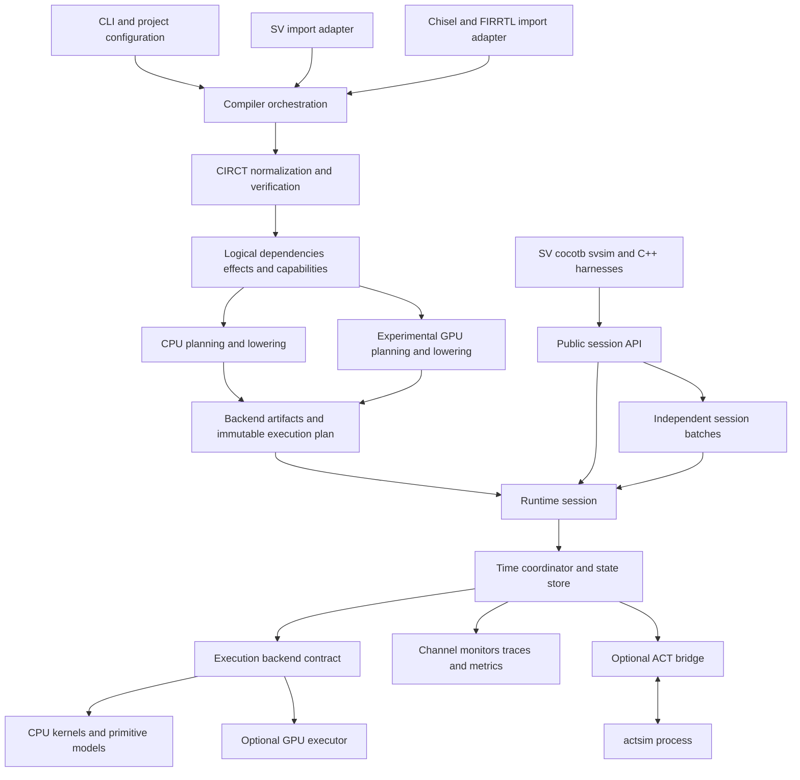

# Chiselator software architecture

Draft implementation blueprint, updated October 5, 2026. This document makes the [simulator proposal](simulator-proposal.md) concrete. It specifies proposed components and contracts; the APIs, file layout, and command examples below are not implemented. Project-authored code uses Apache-2.0.

The [researched MVP feature list](mvp-feature-list.md) defines a proposed first-team release cut, including a thin MCP interface over the same job and report APIs. It distinguishes that release from the broader milestone envelope.

The [simulator test plan](test-plan.md) maps those requirements to semantic, differential, replay, integration, endurance, and packaging suites, with proposed CI gates and implementation effort.

The [five implementation specifications](specs/README.md) refine this blueprint into proposed contracts and take precedence over overlapping sketches. The dependency order is chisel-async, RISCay-MCU, Chiselator, then physical chip implementation. Steps 1–3 target native Windows x86-64/Linux x86-64/macOS arm64 functional development with no Yosys, PDK or physical-build requirement. All physical dependency decisions and feasibility gates are deferred to the [step 4 backlog](chip-build-plan.md).

Build [chisel-async](chisel-async.md) before the main simulator implementation. Its independent functional library, external simulation views and scientific test corpus establish the contracts that the runtime must preserve. The library is an independently designed evolution of async Chisel ideas, with its own release/versioning and completeness catalog; it is not a renamed upstream copy.

chisel-async and the [Raspberry Pi power-supervisor MCU](async-mcu.md) each have a dedicated repository to be added by the project owner. The library owns reusable components/SV views; the MCU owns RTL, firmware, board profiles and application/physical tests; Chiselator owns compilation, runtime and integration adapters. Integration manifests pin exact source/artifact and contract versions. Keep small shared/minimized fixtures or pinned corpus references here, not duplicate product implementations.

## Architecture decisions

Build a modular application with a self-contained CPU executable as the default distribution. Use CIRCT/MLIR for shared native compilation, LLVM for CPU machine code, and an explicit event contract shared by clocked and asynchronous designs. Preserve an optional GPU execution backend and keep ACT in an optional separate process. A standalone clocked Chisel or SV design does not require channel wrappers, ACT, or GPU libraries/drivers.

The central boundary is a compiled model: **backend executable artifacts plus an immutable execution plan**. The CPU realization contains native kernels; a future GPU realization may use device kernels or a mapped Boolean program. The compiler determines what can run together; the runtime determines when it may run. Channel contracts sit above circuit execution and let a testbench substitute behavioral, QDI, bundled-data, or wrapped synchronous implementations.

| Decision | Implementation consequence | Status |
| --- | --- | --- |
| CIRCT is the native compiler foundation | Both source paths converge before simulation optimization | Project decision |
| A supported CIRCT subset defines circuit semantics | No independent replacement HDL IR or parser | Project decision |
| The execution plan describes scheduling and storage | It references compiled kernels; it does not redefine arithmetic or HDL semantics | Proposed boundary |
| CPU and optional GPU execution share semantic contracts | Backend-specific plans and layouts preserve the same requested observations | Project direction; GPU implementation experimental |
| Batch execution contains independent sessions | Seeds, logical time, state, limits and results remain separate per session | Proposed interface; CPU implementation first |
| One owner coordinates logical time | Begin with serial scheduling; parallelize eligible work later | Proposed baseline |
| Arc supplies reusable lowering where verified | Isolate Arc integration behind the compiler backend | M0 experiment |
| Runtime interfaces do not expose MLIR objects | Runtime tests and external harnesses can run without frontend dependencies | Proposed boundary |
| Rust runtime and application with a C++ compiler component | A versioned C interface separates runtime ownership from CIRCT/LLVM objects | Project decision |
| Source annotations carry channel/timing intent | Lowering must preserve and verify provenance | Project decision |
| ACT is optional and out of process | Native simulation works without it; its time-control API is an M0 gate | Project decision plus experiment |

Use a Rust workspace for the runtime and application, and C++ with CMake/Ninja for CIRCT/MLIR passes, backend lowering and initial LLVM ORC integration. Pin both toolchains before implementation. Python supports orchestration and the independent test reference; it is not required for native SV simulation. Link the compiler component into the shipped executable through a narrow C interface. ACT remains a separate optional process; this language split does not introduce a network service.

## Hybrid implementation language contract

Rust owns simulation execution policy and the product lifecycle. C++ owns the compiler infrastructure and generated-code loading. CIRCT remains the shared circuit representation; the language split introduces neither a replacement HDL IR nor a second scheduler. Generated CPU kernels are machine code produced through LLVM, not generated Rust source compiled by invoking `rustc` for each design.

| Area | Implementation | Boundary |
| --- | --- | --- |
| Session scheduler, state, queues, built-in primitives and channel monitors | Rust | Typed IDs and explicit ownership; generated kernels receive checked storage bindings |
| CLI, MCP, configuration, jobs, batches, reports, replay and ACT supervision | Rust | Shared runtime/product APIs; I/O concurrency does not determine logical event order |
| CIRCT import, normalization, custom passes, execution planning and LLVM lowering | C++ | CIRCT/MLIR handles and classes stay inside the compiler component |
| CPU executable preparation and ORC ownership | C++ behind a C interface | Rust executor owns an opaque prepared-model handle and releases it after all users finish |
| GPU host orchestration | Rust with narrow foreign adapters where required | Device API and kernel language selected independently; GPU remains optional |
| Logical model validation and artifact/report handling | Rust | C++ emits the versioned plan/schema; each side verifies its boundary invariants |
| Public embedding API | C ABI implemented by Rust, with typed Rust and C++ wrappers | No Rust or C++ native object layout becomes a public contract |
| Test reference and differential orchestration | Python | Independent implementation of the small semantic subset |
| chisel-async and harness adapters | Scala, SV and adapter-required languages | Independently released library contracts; equivalent SV interfaces and explicit adapter compatibility |

The compiler component may contain substantial custom C++ passes. Budget for that work explicitly rather than treating it as a trivial wrapper. MLIR's C API currently offers no stability guarantee, and Rust bindings such as Melior remain an option to evaluate rather than a required dependency for comprehensive CIRCT access. Own a small project-level interface and pin the underlying compiler revisions. [MLIR C API](https://mlir.llvm.org/docs/CAPI/), [Melior](https://github.com/mlir-rs/melior).

### Foreign interface ownership and errors

Keep three interfaces distinct: the internal compiler service interface, the generated-kernel/runtime ABI, and the public embedding ABI. Internal interfaces may change with an exact toolchain/artifact version; public compatibility has its own release policy. All use documented C-compatible layouts or opaque handles, explicit lengths, fixed-width fields where applicable, status codes and structured diagnostics.

The compiler interface performs coarse operations such as compile, prepare executable artifacts, retrieve plan/diagnostics, and release. The kernel interface invokes eligible regions and exposes necessary scheduling/effect helpers. Avoid foreign calls for each pure arithmetic operation or simulated bit; generated code should evaluate pure work locally. Do not bypass scheduling semantics merely to reduce calls.

Allocation and destruction stay paired on the owning side. C++ releases compiler/JIT objects and compiler-owned buffers through its API; Rust owns session allocations and supplies storage only for a documented borrow or retained lease. No `Vec`, `String`, Rust enum layout, STL object, exception, or raw MLIR object crosses an ABI. C-compatible Rust structures use explicit representation, and both sides check sizes, alignment, field offsets and version negotiation. Serialized plans remain a separate portable encoding, not a dump of ABI structs.

Keep `unsafe` limited to reviewed boundary modules for foreign calls, kernel entry points, device access and any measured low-level optimization. Safe wrappers establish bounds, initialization, aliasing, thread-affinity and lifetime requirements; a raw foreign handle is not automatically safe to share across threads. Generated kernels cannot retain borrowed buffers after their execution lease, and model/JIT destruction waits for sessions and outstanding work.

Expected failures use status/results. Prevent panics and foreign exceptions from crossing the interface. Catch recoverable unwinding panics inside Rust entry wrappers where the build policy permits it, mark affected sessions failed, and convert them to internal-error diagnostics; do not resume potentially inconsistent state. Abort-mode panics and fatal foreign failures require process/job supervision and cannot be converted by such a wrapper. C++ adapters contain enabled exceptions locally; ordinary compiler diagnostics use explicit error paths. [Rust FFI and unwinding](https://doc.rust-lang.org/nomicon/ffi.html).

### Runtime implementation discipline

Use dense arrays, typed indices and reusable event/payload storage. Prefer ownership separation between immutable plans, mutable sessions and backend resources over pervasive shared mutable objects. Adopt unchecked access only for measured bottlenecks with a documented invariant and dedicated boundary tests. Implement hardware overflow, masking and shifts explicitly; results must not depend on Rust debug/release overflow behavior.

An asynchronous I/O executor may supervise jobs, pipes and MCP requests, but does not schedule circuit events. The deterministic session coordinator retains physical/delta/phase ordering. Logical simulation remains independent of host task wakeups and worker assignment.

Rust does not establish circuit correctness or make C++ and generated code memory-safe. Preserve reference comparisons, cross-language lifetime tests and generated-kernel instrumentation. Benchmark the complete hybrid path, including region calls and effect callbacks, before making any speed claim based on implementation language.

## Components and dependency direction



| Component | Owns | Does not own |
| --- | --- | --- |
| `driver` | CLI, configuration precedence, diagnostics, run manifests | Circuit semantics |
| `compiler/import` | Frontend invocation, source maps, elaboration options | Event execution |
| `compiler/normalize` | Supported-operation checks, linking, explicit state/effects, annotation provenance | Runtime queues |
| `compiler/plan` | Logical regions, dependencies, effects, eligibility and backend planning inputs | Current simulation state |
| `compiler/codegen` | Arc adapter and backend-specific lowering, layout and executable artifacts | Global event ordering |
| `runtime` | Session state, queues, phases, clock sources, activation, effect commits | HDL parsing or MLIR passes |
| `execution` | Backend discovery, capability checks, prepared executors, submission/completion and resource release | New circuit semantics or implicit phase advancement |
| `batch` | Independent session grouping, per-session results, budgets and cancellation routing | A shared simulated clock or shared random stream |
| `models` | Built-in C-element, latch, mutex, delay, and synchronizer contracts | Implicit access to arbitrary state |
| `channels` | Typed contracts, adapters, transaction IDs, protocol monitors | Invented timing or free buffering |
| `timing` | Step 3 constraint graph, source/model provenance and declared-delay checks; step 4 extension points for SDF/STA | Physical-tool dependency or physical signoff in the functional MVP |
| `integrations` | C ABI, cocotb/svsim adapters, ACT transport | A second scheduling definition |
| `observability` | Event traces, waveforms, counters, replay information | Mutating model state through tracing |

The small Rust `model` and `support` crates contain IDs, descriptors, error codes and checked serialized schemas without a CIRCT dependency. C++ exchanges data through versioned schema encoders and C declarations, not by sharing Rust object layouts. Maintain one authoritative definition per boundary with reproducible binding/schema generation where useful and conformance tests on both sides. Runtime code depends on these crates, not on compiler classes. Channel monitors consume runtime events; they do not poll mutable compiler IR.

## Multiple execution backends

Support multiple implementations of circuit execution without introducing another source language IR. Chisel and SV still converge through the verified CIRCT subset. Semantic identities, effects, timing constraints and observation requirements are common; partitioning, physical storage and executable code may differ by target. Sharing a semantic contract does not require identical CPU and GPU schedules or layouts.

| Path | Role | Initial status |
| --- | --- | --- |
| CPU native | General supported clocked/async execution, interactive harnesses, debugging and semantic-preserving fallback | Required baseline |
| GPU batch | Many independent runs of the same eligible model; first candidate is clocked RTL, followed by small async delay-sweep experiments | Optional experiment after CPU/reference correctness |
| GPU single design | Large synchronous regions or a complete eligible design with sufficient parallel work | Later experiment; no speedup commitment |
| ACT process | Explicitly bound ACT/QDI models coordinated through the process protocol | Existing optional integration; separate from CPU/GPU placement |
| Independent reference evaluator | Small test-only semantic oracle with its own implementation | Validation tool, not a production backend |

ACT selects a model implementation and coordination boundary; CPU/GPU selection chooses where eligible native work executes. These are separate decisions. Never replace an ACT binding with a native approximation because ACT is unavailable. Likewise, Arc is a compiler reuse choice, not a runtime device selection.

### Backend selection and capabilities

Define an internal `BackendCapabilities` record covering backend/version, supported operations and effects, value/time/phase modes, observation guarantees, callbacks, batch support, device/driver requirements and resource limits. Eligibility is checked against the fully resolved model and requested run configuration. Hardware availability alone is insufficient.

The default selects CPU. A proposed `auto` policy may select a validated accelerator only when semantics match and a measured cost model favors it; otherwise it selects CPU and reports why. An explicit GPU request fails with an actionable unsupported/unavailable diagnostic rather than silently running on CPU. Reports record requested and selected backend, device, eligibility findings and fallback reason. The CPU fallback applies only where the CPU supports the same model contract.

Select placement before execution. A device fault ends affected runs with an honest error/partial result. Do not silently migrate live state to CPU or restart after externally visible side effects. A fresh CPU replay is a separate run; seamless migration requires a future, validated state-transfer/checkpoint contract.

### Execution and memory boundary

Use internal operations equivalent to `query_capabilities`, `prepare`, `submit`, `collect`, `request_cancel`, and `release`; these are proposed responsibilities, not frozen public symbols. A submission identifies sessions/regions, authorized logical frontier, input changes, budgets and required observations. Completion identifies each session's actual frontier and phase, committed updates/observations, stop reason, and whether state is settled and readable.

The CPU backend may complete inline. A GPU backend may return a completion token and retain device-resident state. Host reads and callbacks occur only after the required completion/publication boundary. Backend buffers are opaque; kernels receive explicit typed bindings and declared effects rather than a universal host pointer or arbitrary C++ callback. The public session API remains independent of device memory and driver types.

Separate logical signal/state IDs from physical layout. CPU plans may use per-session aligned words; GPU batch plans may place one signal across many sessions in adjacent storage. Preserve widths, masking, initialization and source mapping in both. Per-session state, memory contents and event queues count toward the batch's memory budget; no fixed batch size is promised.

Batch only compatible models and execution/observation policies. Give every session a stable identity, seed streams, logical time, pending events, limit and terminal result. A completed, failed or canceled session cannot affect another session's data or random choices. Compaction or rescheduling maps physical lanes back to stable session IDs. CPU job concurrency, GPU batch width and future within-session threading are separate controls.

### Timing and observation boundaries

Acceleration may perform more work per submission only when it preserves all required events and observations. The session coordinator authorizes advancement up to a safe boundary; a backend must service earlier internal obligations and yield for required external input, reset, callback, ACT exchange or observation. An output requiring a host response ends the execution window. Zero-lookahead interactions may eliminate useful batching.

For batch async experiments, each run retains exact integer time, delta/phase processing, delayed payloads, cancellation and arbitration semantics. Independent runs need not share a time frontier. Do not quantize time or remove pulses to make GPU execution regular. A backend that cannot preserve requested hazard traces or callback phases is ineligible for that mode.

Keep state resident and exchange bounded batches where possible. Observation buffers need an explicit capacity/overflow policy; yield or fail diagnostically instead of silently dropping required transitions. Cancellation is acknowledged at a documented safe point with bounded work chunks; a request alone does not make device execution complete or resources releasable.

### Experimental scope and evidence

The first experiment compares a clocked datapath and a small bundled-data pipeline across increasing numbers of independent runs. Measure cold preparation, warm execution, transfers, checks, reports, peak device/host memory and complete test turnaround against equivalent parallel CPU runs. Use exact comparisons for deterministic cases and replayed legal choices for nondeterministic ones. A GPU backend enters a supported release only after capability, differential, replay, cancellation and failure tests pass on its declared device/driver matrix.

RTLflow provides prior art for stimulus-level batching. GEM provides prior art for mapping a design to a GPU-executed Boolean processor; its documented workflow excludes latches and other asynchronous sequential logic and requires noninteractive stimuli. Neither establishes our async semantics. MLIR GPU infrastructure is a possible lowering tool, not a ready-made simulator. [RTLflow paper](https://tsung-wei-huang.github.io/papers/icpp22-rtlflow.pdf), [GEM workflow](https://github.com/NVlabs/GEM/blob/staged-aig-release/usage.md), [MLIR GPU dialect](https://mlir.llvm.org/docs/Dialects/GPU/).

Reserve the interfaces now; do not require a GPU implementation, GPU hardware or CUDA installation to complete the CPU MVP. Choose a first device API/toolchain after the experiment. Ship accelerator dependencies as an optional distribution component with explicit compatibility information.

## Compiler input and lowering contract

Chisel elaboration produces FIRRTL consumed by firtool/CIRCT. The SV adapter uses slang through circt-verilog. Each adapter produces CIRCT IR plus source/provenance information. Mixed designs link external modules against checked SV definitions or built-in primitive bindings. Duplicate definitions, parameter mismatches, missing bindings, and width mismatches fail before execution.

The normalized input is a verified subset of existing dialects: `hw`/`comb`/`seq` for supported structure and logic, and LLHD operations where processes, waits, and delayed behavior must remain explicit. Arc is the preferred simulation lowering layer. Its process/wakeup machinery is relevant, but does not by itself prove our phase contract. [LLHD](https://circt.llvm.org/docs/Dialects/LLHD/), [Arc](https://circt.llvm.org/docs/Dialects/Arc/).

Add attributes first for information that does not change execution semantics: channel identity, constraint origin, and profile identity. If a primitive has semantics that existing operations cannot express safely, use a registered model binding or a small verified extension operation. Do not represent a side-effecting operation as an unrecognized attribute on a pure operation that a pass may discard.

The proposed pass sequence is:

| Stage | Output | Required check |
| --- | --- | --- |
| 1 Import and elaborate | CIRCT modules and provenance | Exact source/toolchain/options recorded |
| 2 Link and bind | Resolved hierarchy and model contracts | Ports, parameters, definitions, external effects |
| 3 Normalize semantics | Explicit supported state, memories, processes, drivers | No unsupported operation or erased delay |
| 4 Extract contracts | Channel descriptors and symbolic timing graph | Every annotation mapped or diagnosed |
| 5 Simplify pure logic | Narrowed/constant-folded combinational regions | No motion across effects or timing observations |
| 6 Analyze dependencies | State/effect boundaries and residual SCCs | No state-holding loop treated as pure logic |
| 7 Plan execution | Logical regions, subscriptions, state and observation requirements | Scheduling eligibility and complete dependency coverage |
| 8 Optimize the plan | Optional grouping, activity policy, replication | Each transformation preserves the plan invariants |
| 9 Lower kernels | Backend-specific layout and code; Arc/LLVM CPU path first | Hardware arithmetic, effects and backend calling conventions preserved |
| 10 Assemble model | Immutable backend plan plus executable artifacts and debug map | ABI/schema/hash/capability consistency |

These are Chiselator stage names, not claims that upstream passes with these names exist. Use the MLIR pass manager for implementation and verification. Diagnostic builds retain before/after IR and transformation provenance. [MLIR pass infrastructure](https://mlir.llvm.org/docs/PassManagement/).

Observation policy is a compiler input. A transaction-only run may eliminate internal pure transitions; gate-hazard, detailed waveform, or switching-count modes must preserve the requested events. Reject an unavailable observation rather than returning a silently optimized-away signal as if it were accurate. Observation policy participates in the cache key.

## Compiled model and execution plan

Maintain a clear distinction between immutable program data and per-run state. One compiled model can serve many independent seeded sessions.

| Record | Main fields | Invariant |
| --- | --- | --- |
| `ModelDescriptor` | Schema/ABI versions, semantic model identity, backend/target, toolchain hash, value/time modes, capabilities | Must match executable artifacts and runtime |
| `SignalDescriptor` | Logical ID, width, value kind, storage binding, producer/driver, subscribers | Every observable update has defined ownership |
| `StateDescriptor` | Logical ID, kind, storage binding, initialization, update trigger, owner | State is not inferred from an anonymous feedback loop |
| `BackendLayout` | Logical IDs to physical bindings, target alignment, batch strides and ownership | Host/device pointers are private to a prepared executor |
| `BackendArtifact` | Backend and ABI, target requirements, layout/plan/code hashes, semantic model identity | Each executable variant implements its declared contract |
| `MemoryDescriptor` | Geometry, ports, latency, collision behavior | Host worker order never selects collision behavior |
| `RegionDescriptor` | Kind, kernel ID, inputs/outputs, trigger, effects, policy | Pure and side-effecting work are distinguished |
| `Subscription` | Source, value/edge predicate, destination, scheduling action | Wakeup conditions are complete |
| `ChannelDescriptor` | Semantic ID, payload, protocol, endpoint mapping, reset, obligations | Encoding adapters satisfy the same transaction contract |
| `ConstraintDescriptor` | Semantic ID, launch/endpoints, relation, margin intent, provenance | Survives lowering or produces a diagnostic |
| `DebugMap` | Runtime IDs to source, hierarchy, semantic IDs | IDs are reproducible within the artifact |

Dense integer IDs index arrays in the running simulator. Source-declared semantic IDs identify channels and constraints across transformations. They are not interchangeable with runtime indices. Maintain explicit one-to-many mappings when a compiler splits or replicates a node; ambiguous mapping after a semantic refactor is an error requiring a migration.

For CPU execution, store native-width scalars directly and wider values in aligned word arrays with explicit masking. Other backends may choose different physical layouts while preserving logical values. Pack four-state data only in a supported X-aware configuration. M2 initialized bits are a separate property of state, not a four-state encoding. Memory contents and suspended-process state remain logically session-owned even when allocated on a device.

A development model package contains a manifest, compact plan, backend executable artifacts, and debug/provenance map. Initially it contains one CPU variant; a future package may contain several variants sharing a semantic model identity. Use a readable JSON plan dump for inspection; define a checked binary encoding for the runtime when measurements justify it. Serialized records use IDs/offsets, never host/device pointers. The loader checks bounds, versions, required capabilities, and checksums before preparing an executor. Target-specific model code is local executable code, not a portable untrusted document format.

LLVM ORC is the proposed CPU JIT integration. Cache relocatable objects and metadata, then load them into a session-capable executable. The public interface must not expose ORC implementation types. A GPU compiler/loader is a separate backend responsibility and is not assumed to reuse the CPU object format. Start with explicit quick/optimized builds; defer background code replacement. [LLVM ORC](https://llvm.org/docs/ORCv2.html).

## Runtime and scheduler

Each `SimulationSession` owns logical time, state storage, process continuations, queues, driver transactions, activation generations, random streams, and monitor state. The baseline has one coordinator thread and no shared mutable circuit state across independent sessions. Multiple sessions can share immutable code and backend resource pools with explicit lifetimes. Device execution is subordinate to the session's authorized frontier; it does not introduce a second definition of time.

Use `TimePoint { ticks, delta, phase }` for reporting logical execution position. Use checked integer physical time with a declared resolution, initially femtoseconds for the Arc adapter. Check conversion and addition for overflow; represent “no next event” as a tagged value rather than consuming a valid timestamp. Delta count and phase remain explicit even when a backend represents physical time with one integer.

### Queue discipline

Maintain distinct active/reactive work, inactive zero-delay process resumptions, pending nonblocking updates, harness callbacks, and a heap of future physical-time events. Region dirty flags deduplicate eligible pure reevaluation; they do not deduplicate delayed signal transactions or process side effects.

The initial supported scheduler subset follows these rules:

1. Enter the earliest eligible physical time, installing due events into their proper queues. Preserve required source ordering; deterministic tie breaking does not redefine an HDL race.
2. Drain active work. Blocking procedural assignments become visible according to process semantics and can wake other active work. A process continues until its suspension/termination point.
3. When active work empties, service inactive resumptions such as supported `#0`, then repeat active processing as needed.
4. Once those queues are empty, process eligible nonblocking updates with required per-process ordering. Updates can create active work; return to the appropriate earlier phase before declaring the time slot complete.
5. Permit supported read/write harness callbacks at their defined synchronization point, repeating evaluation if they drive inputs. Read-only callbacks run only after that time slot is settled and may not drive signals in it.
6. Advance physical time only when current-time obligations and required backend exchanges are complete.

This is a restricted scheduling contract, not a claim of every SV region or full SVA/program-block support. Specify exact supported callback mappings in tests before releasing an adapter. Phase re-entry requires a state machine; sorting all work by a timestamp tuple is insufficient. Conflicting writes from unordered processes are diagnosed where detectable rather than resolved by host thread timing.

Two ordering fixtures define essential behavior. For `q <= d` on an edge, `d` is sampled when that statement executes, `q` changes at its scheduled update, and consumers triggered by `q` run before the final read-only observation. For two clocked registers swapping values on simultaneous edges with nonblocking updates, both read the pre-update state. A compiler that exposes one new register value to the other has failed, even if a later final-state hash matches.

### Event and driver records

An event carries physical target time, destination, event kind, source ordering identity, captured payload, and optional cancellation token. Driver queues preserve multiple transitions. An inertial primitive owns its cancellation rule; a transport primitive preserves its transition sequence. Do not recompute an event's payload from later signal state.

Clock sources use the same event mechanism. Pausing a source cancels only its future transitions through generation-tagged tokens; already delivered edges remain delivered. Reset can run while a clock is paused. Toggling or resuming a clock is not equivalent to advancing a fixed number of global cycles.

Subscriptions and process resume tokens prevent an old timeout or obsolete sensitivity registration from waking a process after it has moved to a different wait. Re-arm and cancellation behavior is part of the process contract and is tested independently of generated code.

Bound delta work and physical events with explicit run budgets. On exhaustion, return a diagnostic containing the current time, active processes, and repeated-state evidence where available. Distinguish zero-time nonconvergence, a valid timed oscillator, environment timeout, and a proven stuck protocol obligation.

## Kernel and state ownership contract

The compiler emits different entry-point kinds: pure combinational evaluation, clock-triggered sampling, process resume, and primitive evaluation. They share a versioned runtime context but have different permissions.

| Entry point | May do | Must not do |
| --- | --- | --- |
| Pure kernel | Read declared inputs; calculate outputs and change information | Advance time, perform I/O, or mutate unrelated state |
| Clock sampler | Read an eligible snapshot and stage owned next-state updates | Commit state visible to another sampler prematurely |
| Process resume | Update private continuation; perform declared assignments/effects through helpers | Bypass suspension, phase, or driver semantics |
| Primitive model | Execute its declared state/driver contract | Read undeclared global state or silently invent reset behavior |

Pure local values may stay in registers; not every internal assignment requires a callback. Observable outputs and cross-region dependencies have explicit publication points. Pure synchronous regions can use disjoint next-state buffers; behavioral processes must retain their assignment semantics and are not blindly converted to double buffering.

Keep helpers for scheduling drivers, staging updates, suspending on events, reporting diagnostics, and emitting observations. Inline or batch helpers only when equivalent. This interface is the backend replacement boundary: Arc-derived and custom kernels must obey the same rules, so replacing lowering does not replace harnesses, channel contracts, or tests.

Optimization obligations are explicit:

- Activity tracking may skip a pure region only when no relevant dependency or forced trigger requires it.
- Unconditional regions still activate downstream tracked consumers correctly.
- Clear/consume an activation before executing, or use generations, so reactivation is not lost.
- Replicate pure computation only; never duplicate state commits, timers, monitors, or foreign calls.
- A parallel epoch ends with ordered publication before any observer can read its result.
- Full-scan mode evaluates all eligible pure regions without replaying side effects.

Each optimization produces a plan transformation report and has an off switch. Initially compile conservative regions and run serially. Add profile-driven policies only after trace equivalence is established.

## Public API and model lifecycle

Expose opaque handles and versioned C structures through a dedicated Rust embedding crate; provide typed Rust and C++ wrappers. Do not expose Rust collections/native layouts, C++ STL objects, MLIR types, exceptions, or JIT addresses across the public ABI. All calls return a status and structured diagnostics. Compiler and runtime APIs are separate even when both are packaged in one executable. Publish the embedding library and C headers as an SDK; the normal CLI remains self-contained.

The initial proposed operations are:

| API operation | Contract |
| --- | --- |
| `compile(project, options)` | Resolve sources and emit a model handle/package or source diagnostics |
| `create_session(model, run_options)` | Allocate independent state and seeded policies; no circuit execution yet |
| `initialize(session, input_values)` | Apply declared startup inputs and source/model initialization; schedule startup processes; settle time zero or report a stop |
| `drive(session, port, value, when)` | Schedule a harness-owned input update; reject past time, invalid width, wrong direction, or illegal callback phase |
| `run_until(session, limit, budget)` | Process events at or before the inclusive limit and settle that slot; return completed, finished, budget stop, or error |
| `settle(session, budget)` | Finish current-time work without advancing physical time |
| `next_event(session)` | Query the next physical-time frontier, accounting for external backends |
| `read(session, object)` | Copy value plus known/initialized status at a valid observation point |
| `finish(session)` | Execute supported finalization exactly once and flush diagnostics/traces |
| `destroy_session(session)` | Release resources; no implicit successful finalization after a failed run |

These are interface sketches, not frozen symbols. Specify widths, ownership, lifetimes, callback restrictions, and struct versioning in the actual headers. A budget stop inside a phase is resumable but is not a settled observation point. User callbacks execute on the coordinator thread; only explicitly supported callback operations may re-enter the runtime. Initially use one thread per session API caller, with no simultaneous calls on the same session.

Add capability queries and backend preference to compile/session options. A future `run_batch(model, cases, policy)` facade composes independent session lifecycles and returns per-case results; start with CPU jobs behind that interface. It does not replace `run_until`, force runs into lockstep, or promise that arbitrary interactive harnesses execute on a GPU. While a batch owns a session, external callers cannot concurrently step it.

Model handles outlive their sessions and own executable artifacts. Session state and callback/user buffers have separate lifetimes. `read` copies data instead of returning a pointer that a later step can invalidate; device reads synchronize at a valid observation boundary. Compiled-model destruction cannot unload code still used by a session or outstanding submission. Releasing a session waits for or safely terminates its outstanding backend work before freeing referenced storage.

The CLI uses these APIs, as do adapters. SV testbench processes run through the same scheduler. Cocotb maps validated callbacks through GPI/VPI. Chisel svsim gets a protocol adapter for a pinned version. A Verilator-style C++ wrapper translates top-level port changes and evaluation calls; it must document its timed-query behavior and supported API surface.

## Channel and timing interfaces

Define a `ChannelContract` with semantic identity, payload fields, handshake encoding, reset phase, allowed outstanding transactions, ordering rules, and backpressure behavior. A `BlockBinding` selects an implementation and adapter for a contract. Validation rejects an adapter whose buffering or ordering cannot satisfy the contract.

For example, a one-input/one-output incrementer has one transaction-level scoreboard. Bind it to a behavioral model, a dual-rail QDI stage, a bundled-data stage, or a clocked register stage behind a handshake wrapper. The scoreboard compares accepted input/output transactions. Separate monitors test each encoding, and timing reports retain implementation-specific latency. Reset defines whether pending transactions are aborted or must complete; it cannot silently change when a binding is swapped.

Monitors consume committed protocol transitions with transaction and source IDs. Repeated equal payloads still create distinct transactions. A completion obligation records what is awaited and the environment assumptions needed to diagnose a deadlock. Tests may impose deadlines without claiming that every timeout proves deadlock.

`timing` owns a symbolic constraint graph, such as “data arrival precedes capture for this launch.” In step 3, compiler provenance maps endpoints into lowered signals and behavioral models; declared delays drive model-level checks with independently derived expected results. Missing endpoints, assumptions or critical annotations fail validation. Mapped netlist pins, STA adapters, SDF import and physical cell libraries are step 4 extensions, not dependencies of functional execution. Random RTL delays stress ordering but do not supply physical setup/hold evidence.

The timing adapter publishes its supported cell/delay/check capabilities in the model descriptor. Numerical delay policies belong to modeled drivers; protocol constraints belong to monitors. Keep those interfaces separate so an optimizer cannot satisfy a check by changing the same user-entered number that defines the simulated behavior.

## ACT process protocol

Start with a length-delimited local pipe protocol. Encode control records with a readable versioned schema for the prototype; batch payloads later only if causality allows it. Do not depend on terminal text scraping for the final integration.

| Message | Required content |
| --- | --- |
| `Hello` | Protocol version, backend revision, precision, supported value/phase modes and capabilities |
| `Load` | Design and contract hashes, selected block bindings, initialization and seed policy |
| `Inject` | Timestamp/phase contract, endpoint, transaction or event identity, payload and unknown status |
| `Advance` | Safe frontier and execution budget; whether the frontier is inclusive |
| `Yield` | Actual frontier reached, emitted boundary events, next internal event/lower bound, current-time quiescence |
| `Stop` / `Error` | Reason, source/block context, resumability, trace position |

Every request has a sequence ID and exactly one completion response. EOF, malformed data, a nonmonotonic timestamp, or a backend that overruns the granted frontier ends the run with a diagnostic. Wall-clock timeout is transport supervision, not simulated time.

Current-time quiescence requires both engines and the communication queues to be quiescent. A backend's next internal event is not permission to ignore an earlier event generated by the other engine. With zero lookahead, use lockstep exchange or co-locate inseparable regions; reject unsupported phase mappings. M0 tests whether actsim exposes enough control to implement this contract. No compatible native API is presumed by these proposed message names.

Keep transistor/gate hazard checks inside a backend unless the boundary preserves the needed transitions. Transaction-only interchange cannot validate cross-boundary forks. Native operation without ACT is a mandatory integration test. Cross-process checkpointing is deferred until both backend states and in-flight messages can be restored consistently.

## Configuration cache and observability

Resolve CLI overrides over `tool.toml`, then construct an immutable `ResolvedProject`. This object contains selected sources/parameters, toolchain, source contracts, block bindings, value/observation modes, and target. Validate it before expensive compilation.

Use two identities: a build key for compiled behavior, and a run identity for dynamic inputs/policies. Include source/include contents, elaboration outputs, relevant environment/build inputs, frontend revisions, annotations, model libraries, optimization profile hash, target/ABI, and compiler flags in the build key. Compile-time SDF/delay specialization belongs there too; dynamically loaded timing data instead belongs in the run manifest and must match the model's declared capabilities.

Backend executable variants have separate build keys including backend compiler revision, target instruction set, layout and compile-time batch specialization where used. Record device/driver/runtime versions, selected backend, batch policy and transfers in run metadata; include any of these in the build key when they affect generated code compatibility. Never reuse a CPU object as a GPU cache hit. Cross-backend comparison is semantic replay, not an exact rerun of the same executable.

The run manifest records input and model hashes, seeds, delay/corner policy, backend versions, observation settings, and exact reproduction arguments. Use per-object deterministic random streams keyed by semantic identity and purpose, so worker scheduling does not change random choices. Log explicit arbitration choices when algorithm/version changes would otherwise break replay. Cache writes use temporary artifacts and atomic publication; a partial build is never a cache hit.

Include stable session identity in random stream derivation. GPU lane assignment, batch size, completed-lane compaction and CPU worker count must not change a session's choices. Retain failed-case inputs and choices so a supported CPU model can reproduce the semantic failure with detailed tracing. Explicitly report when a failure is device-specific or the requested CPU replay lacks the necessary capabilities.

Events emitted for diagnostics include physical/delta/phase position, source and destination, transaction ID where present, and causal predecessor. Support a bounded recent-event buffer for failure reports, optional detailed traces, and selective waveforms. Record trace coverage and any optimized-away observations. Monitors, tracing, and profiling have separate enable flags; tracing must not change circuit behavior.

Checkpoints later include state, pending queues and payloads, process continuation, cancellation generations, activation, time, random policy state, and monitor state. Restore only with matching schema and model identity. Reference saved objects by ID/offset, never native pointers.

## Repository and build layout

Create these directories as implementation lands; this document does not add empty scaffolding or imply that these targets already build.

```text
Cargo.toml                 Rust workspace and package settings
Cargo.lock                 locked Rust dependencies
rust-toolchain.toml         pinned Rust toolchain
toolchain.lock.json         exact LLVM CIRCT slang and native tool revisions
xtask/                     developer build test and release orchestration
include/chiselator/         public C headers and C++ convenience wrapper
crates/support/            IDs diagnostics hashes and serialization helpers
crates/model/              immutable logical plan descriptors and verifier
crates/compiler-sys/       private raw compiler/JIT C bindings and native link
crates/compiler/           safe compiler/JIT ownership wrapper
crates/runtime/            session scheduler state drivers and memory
crates/execution/          backend contracts and CPU executor
crates/execution-gpu/      optional experimental host executor when implemented
crates/batch/              independent session grouping and results
crates/models/             built-in primitive implementations
crates/channels/           contracts adapters and monitors
crates/timing/             model constraints provenance; SDF/STA deferred to step 4
crates/observability/      traces profiles waves and metrics
crates/act/                optional process protocol and adapter
crates/embedding/          C ABI implementation and SDK library targets
crates/cli/                CLI jobs and MCP facade
compiler/CMakeLists.txt    native compiler component build
compiler/cmake/            dependency discovery and native configuration
compiler/include/          internal compiler service and kernel ABI headers
compiler/lib/import/       SV and FIRRTL adapters
compiler/lib/normalize/    linking legality and annotation preservation
compiler/lib/plan/         dependencies region formation and activity policies
compiler/lib/codegen/      Arc adapter LLVM and ORC integration
compiler/lib/capi/         coarse compiler/JIT C interface implementation
integrations/cocotb/        GPI/VPI and make integration
integrations/svsim/         Chisel simulation backend
integrations/chisel-async/ pinned library contracts adapters and integration fixtures
tests/unit/                native unit fixtures; Rust unit tests live in crates
tests/ffi/                 layout ownership error and kernel ABI tests
tests/lit/                 compiler transformations and negative diagnostics
tests/reference/           small independent semantic evaluator
tests/integration/         frontends harnesses timing and ACT fixtures
tests/differential/        generators reducers and retained counterexamples
tests/packaging/           clean-host install and no-compiler tests
benchmarks/                pinned workloads profiles and result schema
docs/adr/                  evidence-backed architecture decisions
```

Use Cargo tests for Rust runtime/model contracts, CTest with C++ unit tests for compiler/native helpers, lit/FileCheck for transformations, and Python orchestration for differential/integration runs. Runtime-only crates and tests must not require linking or building CIRCT; mock prepared executors exercise their boundary. The combined ABI lane must run actual compiled kernels.

Use an `xtask` build entry point to provision/check locked dependencies, run CMake/Ninja for the native component, and link its outputs into Cargo targets. Reuse fingerprinted native builds rather than rebuilding LLVM on every Cargo invocation. Include Rust/compiler versions, profiles, native ABI settings, schema revisions and relevant flags in cache identities. CI checks that bindings and schemas match their authoritative definitions.

The developer build may link shared toolchain libraries. Release packaging bundles/links required native components to meet the self-contained CPU contract; shipped users need neither Cargo/rustc nor clang/g++ for built-in simulation. Chisel's JVM and Python harness requirements remain separate. An optional SDK publishes the embedding library, headers and its platform/link requirements. Test mixed Rust/C++ linking, debug symbols, dependency notices and clean-host installation on each supported platform. Re-estimate integration effort after the first ABI/build spike rather than assuming Rust eliminates native packaging work.

## Implementation sequence and acceptance tests

First complete [chisel-async L0–L2](chisel-async.md#library-first-delivery-sequence), then RISCay-MCU C0 on a qualified external simulator, then Chiselator. Neither earlier product waits for a Chiselator executable or a physical probe. Small compiler representability probes may run during functional work. The following are step 3 simulator work packages; they reuse the library/MCU corpus. The [physical delivery gates](chip-build-plan.md#product-order-and-physical-gates) and their dependencies all wait until step 4.

| Package | Concrete output | Completion test |
| --- | --- | --- |
| A Scheduling specification | Queue/phase contract, trace schema, independent reference fixtures | Known results for blocking/NBA re-entry, `#0`, simultaneous edges and read-only observation |
| B CIRCT and ACT probes | Pinned toolchain, minimal import/lowering programs, ACT frontier prototype | Arc ordering matrix and ACT causality matrix, including explicit failures; Arc work stops at the 10-day decision gate |
| C Build and model boundary | Cargo/CMake targets, C bridge, plan verifier, Rust session skeleton | Runtime-only tests run without CIRCT; actual cross-language kernel call, layout/lifetime/error checks and bad-plan rejection pass |
| D Dual-language vertical slice | SV and Chisel counters through compilation to one runtime/API | Reset and edge-by-edge traces match each other, the reference, and an external simulator on shared semantics |
| E Event completeness | Delay drivers, resumable processes, two clocks, pausable clock, minimal SV testbench | Same-time ordering, captured payloads, pause cancellation, reset while stopped and budget resume tests |
| F Native async library integration | chisel-async primitive bindings, channel/manifest validation and initialized bits | Existing independently qualified stage corpus passes native backpressure/reset/repeated-data tests; uninitialized reads and invalid protocol transitions fail |
| G Substitution and ACT | Behavioral/native/QDI bindings under one scoreboard | Transaction equivalence, absent-ACT native execution, precision errors and backend crash handling |
| H Source-to-model timing | Preserved constraints and behavioral delay fixtures; no physical tools/views | Annotation loss fails; modeled short-control, slow-data and hold violations match hand-derived expectations |
| I RISCay-MCU native acceptance | Integrate the separately maintained C0 RISC-V Pi supervisor (proposed RV32EC), its pinned firmware, library/views and external reference corpus | Run in Chiselator at S0; qualified RISC-V retirement/effect and power-policy references pass normal shutdown, wake, reset and fault scenarios without a global CPU clock; physical fit remains a separate gate |

M1's CLI, packaging, cocotb, svsim, and C++ adapter lanes use package D/E fixtures and still have their own release gates. Package D alone is a useful runnable increment, not completion of M1. Gate optimization work on D/E and the relevant async semantics; threading is never a prerequisite for basic SV or Chisel acceptance.

The first engine fixture is deliberately small: compile equivalent 8-bit Chisel and SV counters, apply reset, execute both clock edges, and compare timestamped outputs. Then run two registers exchanging state at coincident edges and a delayed assignment whose input changes before delivery. These expose state visibility and payload-capture bugs that a throughput benchmark can hide. Package I integrates the already externally verified first complete application after F; it does not postpone MCU creation until the simulator exists. It can proceed independently of ACT and full-chip physical qualification. The MCU contract is in [specification 03](specs/03-async-model-contracts.md#first-complete-example-minimal-async-mcu).

Use three complementary checks throughout: an independent small semantic evaluator, full-scan versus tracked native execution, and external tools on the overlapping subset. The reference evaluator must use its own scheduling implementation; sharing all scheduling helpers would hide common bugs. Frontend bugs can affect both internal paths, so external source-level comparisons remain necessary. Fuzzers retain seeds and reduce mismatches into permanent fixtures.

Every supported operation/feature gets a machine-readable entry linking import, lowering, runtime, and negative tests. Coverage is the intersection of those stages. CI builds instrumentation, runs sanitizers where supported, and checks replay. Performance runs use pinned dedicated configurations with held-out profiles and off-switch ablations. No runtime speed claim follows merely from adopting CIRCT or LLVM.

The [test plan](test-plan.md#optional-backend-qualification) adds conditional backend qualification. CPU-only CI and packages remain sufficient for the native MVP. Experimental GPU lanes cannot claim support through CPU fallback; their evidence must identify actual device execution and include the end-to-end cost of transfers and observation.

## Architecture decisions to record after experiments

Create short ADRs with the decision, alternatives, test evidence, and consequences:

1. Native CIRCT input subset and exact toolchain revisions.
2. Arc reuse boundary and delta/phase preservation results.
3. Scheduler/driver semantics and supported SV/callback subset.
4. Model/kernel ABI, state layout, and cache compatibility.
5. ACT coordination capabilities and unsupported boundary cases.
6. Channel/timing annotation provenance and first netlist mapping flow.
7. Execution backend capabilities, logical-to-physical layouts, batch API and selection policy.
8. GPU experiment results, first device/toolchain scope and optional distribution requirements.
9. Hybrid Rust/C++ interface definitions, panic/error policy, binding generation and reproducible build linkage.

Do not pre-label the experimental choices as proven. The architecture is concrete enough to implement A–D now, while the interfaces contain the impact of an Arc or ACT integration failure.
